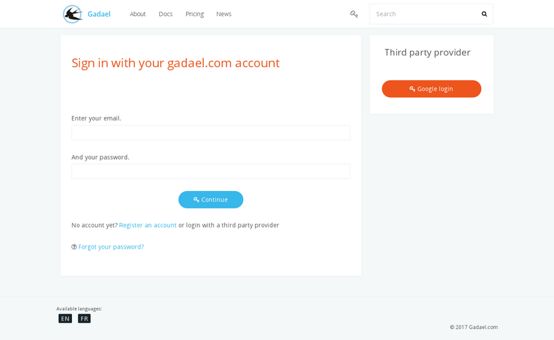

title: "Quick start"
layout: "doc"
contentId: "doc-quick-start"

---

This documentation applies only to the SAAS service hosted on gadael.com. Unlike other pages of the documentation, what is explained on this page can not be achieved using the open source gadael software if it has been installed by yourself on your own server.

<!-- more -->

## Introduction to Gadael.com

This documentation describes the creation of an application hosted on gadael.com and that you can use for your company or association within the limit imposed by the chosen subscription (the number of users authorized on the application depends on the subscription).

If you manage your own server, there is no limit in the number of active users.

### Creating an account on gadael.com

__Name of the site__

The name of the chosen site must not contain any special characters or spaces.

After creating your account, you will be able to launch your application using the setup form. Other account options are not available until the application is launched.

When creating the application, you will be able to choose a country that will be used to initialize the database with the principle leave rights of your country. If your country is not in the list, you will be able to create your application but there will be no default rights, you will have to create them manually.

### Administrator Options

__Work days recovery__

This feature can be enabled to allow employees to report worked time over a period usually not worked. This application will follow an approval process that allows the user to recover all or part of his working time in the form of leave right.

__The maintenance mode__

Maintenance mode can be used when setting up leave rights to prevent users from creating requests while the configuration is not completed.

The maintenance mode allows users to consult their rights but does not allow the creation or modification of requests.

## Your application

### Creating Accounts

When creating your application, an administrator account will be created automatically with the same username and password as your gadael.com account, so you can use this account to access your application and create other administrator accounts.

To create accounts for your users, you can use the "administration > users" menu. It is necessary to assign the role "absences  account" so that the account can be attached to a leave right collection, for more information on the roles, you can consult [the administrator's documentation](002-admin-guide.html).

### Log in as user

After creating a user account and assigning rights to it, you can test it by clicking on your name to log out, the application will then offer you to authenticate again. You can then use your new user account to log in.

For more information about the possibilities of your user account, see [the documentation](004-user-guide.html).
