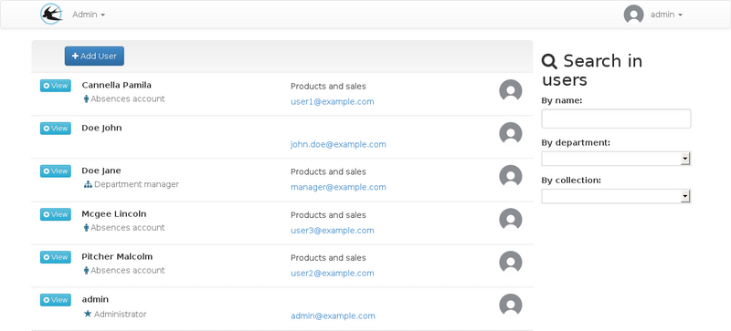
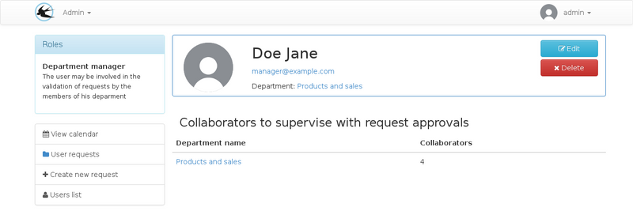
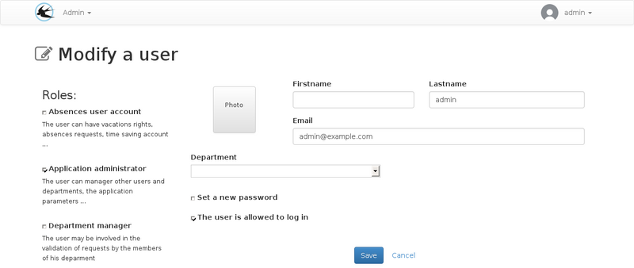
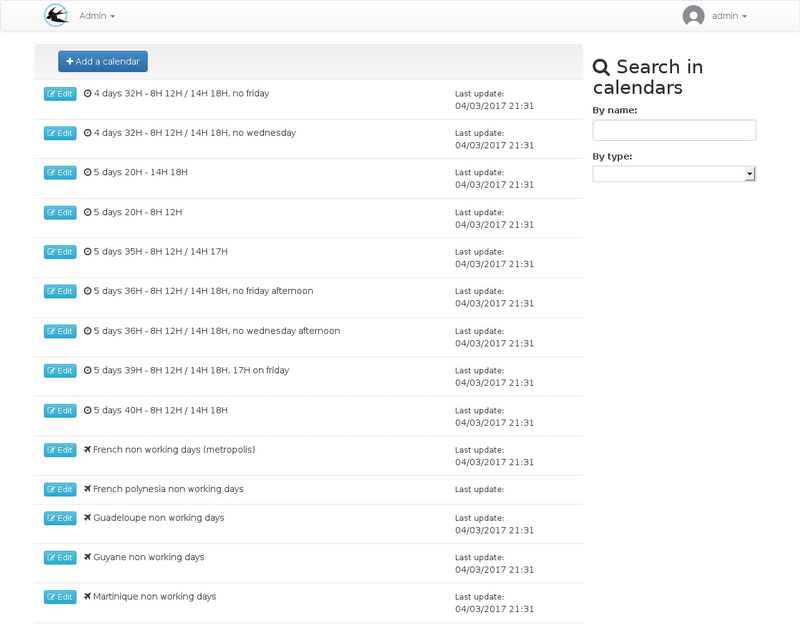

title: "Administrator's Guide"
layout: "doc"
contentId: "doc-admin-guide"

---

Administrators are the people who can access the entire configuration. This documentation describes the management of rights, collections, calendars, users, exports and the creation of absences in place of users.

<!-- more -->

## The users

### Creating a New User

### The roles

#### Absences user account

Viewing a user, messages in red are the missing configuration parameters.

From the visualization sheet, it is possible to define the right collection, the work schedule and the applicable non-working days.
The quantities per right granted to users may be modified for individual cases.

For all these parameters, configurations must be made in the others menus if the proposed choices are insufficient. You can consult the article on [parameter planning](010-planning-of-parameters.html).

Changing a user with an "absences" account

When the "Absences user account" box is checked, other options are visible on the form,
And this causes additional buttons to appear on the user visulisation.

Additional fields available for this role:

* __Date of arrival__: This date is used by the application for the calculation of rights with addition every month. A standard right collection can be associated with the user because the monthly additions will be effective only from that date.
* __Seniority start date__: This date is used to determine whether a seniority right is visible or not.
* __SAGE registration number__: This field is used only in the SAGE export, it allows combination with the Sage accounts during the monthly import of absences periods.
* __The notification options__: Sets the default sent emails. The user can change these settings when connected.

#### Head of Service

The role of the department head is to validate the absences requests made by the members of his department.

A user may be responsible for several departments, in which case he/she will have to approve requests from both services.

If a hierarchy of services is in place, approval will be at several levels. The service hierarchy is used only for approval of requests, so it is not necessary to set it up to represent the structure of the entity, it must be used to represent the hierarchy of the desired approval. For example, if the human resources department must validate all absences, it must be at the top.

Viewing a manager user account:

Modification of a manager user account:

When editing, the mutiple "Departments to Supervise for Requests Approval" selection field determines where the person is responsible.

The department field that is available to all users will be used to determine who is the approver of that person.

#### Administrator

The persons designated by the role are represented in the company by the human resources department.
They will be able to manage leaves and renewal periods.

Editing a User with Only the administrator role

## Types

The rights types allow you to group absences rights between them.

The list of default types:

Creating or modifying a right type:

When creating a request, the user must distribute the requested days on these leave rights. In the list, the rights are grouped by type.
The check box on the type allow to change the default state of the rights in this type. Despite this option, all types can be folded and unfolded manually by the user. The option allows to hide by default the least important rights when there are many rights, for example, for recoveries, the number of rights depends on the number of requests for recoveries accepted beforehand.

## Rights

A right is a set of rules for assigning leave days or hours, on each rights, one or more renewals can be created, they determine the allocation periods, at the beginning of each renewal, the balance is credited taking into account all the absence right parameters.

Depending on the right parameters, it is possible that the user have access to several renewals at the same time when he whant to use his rights credits.

The absence rights list:

From the absence right visualization, several elements can be parameterized:

* The modification of the absence right
* Manage rules list (allows to define the conditions that authorize the use of the balance, for more details, see the [documentation](007-rules-of-rights.html))
* Manage renewals list
* View the list of related rights collections, Absence rights associations with a collection are created on the collection modification form.

### Absence right creation

TODO: screen for creating special rights

When creating a new right, it is possible to create special rights with, for example, a dynamic quantity depending on certain parameters.

In this case it is possible that the initial quantity is not visible or can not be modified subsequently because it will be calculated in a different way at each start of renewal.

### Right Options

| Field Name                  | Home                    |
|-----------------------------|-------------------------|
| Type                        | Rights types allow absence rights grouping by category when creating leave requests |
| Default quantity            | This is the initial quantity of each renewals |
| Unit                        | The quantity can be in days or hours
| Quantity added every month  | Required in the same unit as the default quantity, this field is used to define the amount automatically assigned on each first day of the month, for the entire renewal period. This addition will be made only for dates after the date of arrival in the company (user account field) |
| Active for                  | Determines who can create leave requests. For example for a illness absence right, you may set the administrators only as possible author |
| Automatic distribution      | The quantity to be distributed on the rights will automatically be allocated on this right without exceeding the quantity available and respecting the types and rights order, if another right exists above with this option checked the balance of this right will be used in priority |
| Require an Approval         | This option enable or disable approval. This can be used for declaring sickness absence right, in conjunction with the "Active for" option. |
| Use the default opening period | Unchecking this option allows you to restrict the possible leave period from the request date. For example, to ensure that requests are made at least 30 days before the leave start date. |
| Allow deposits on the time savings account | Check if this right can be saved to a time saving account. |
| Quantity consumed for part-time work schedule | This option allows the choice of the consumption rule for part-time workschedules, for more information consult the [documentation](006-parts-times.html). |

### Renewals

From the right visualization page, you must add renewals so that the right can be accessible. All rights rules are based on renewal periods.

## Absence rights collections

A collection is a set of absence rights that can be associated with users.

A number of collections are initialized during the installation of the application, this list depends on the selected country. New collections can be created if necessary.

The collections list:

Edit form:

When creating a right collection, additional fields can be set:

| Field Name                   | Home                   |
|------------------------------|------------------------|
| The attendance percentage    | This indication is for part-time work-schedules |
| Working days                 | Working days are used when calculating the RTT number of days to be awarded |
| Working days of the collective agreement | The number of days worked in the year will be used for the calculation of the number of RTTs |

Note: RTT is a french specific right, this is a compensation if the work schedule is beyond 35H.

## Requests

Different types of requests can be created by users and administrators.

### Leave requests

An absence request may be a leave request created by a user or an absence declared by an administrator such as sick leave.

Special case: The mandatory leaves are also absence requests created by the administrators. The only difference is that only the mandatory leave form can be used for modification of this type of request. Despite this, they appear in the requests list for both the user and the administrator.

### Work Days Recovery Requests

### Deposit to the time savings account

## Mandatory leave

Mandatory leaves are created by administrators to assign the same absence period to a given users population. It is a tool that allows to create absence periods on several users at the same time with the following characteristics:

* Absences are already validated (no approval circuit)
* Only one absence right is used per period.

The consumed quantity per user may vary depending on the work schedule.

## Exports

### Excel

There are two possible export types in excel format:

#### exporting requests

Exports one line per absence request. Requests must be included or straddling the export form entered period.

#### exporting balances

Exports one line per right and per user with an absence account.

The export form allows you to select a date. The quantities indicated in the various exported columns correspond to the request status at the requested date.

### Sage

Exporting to the SAGE format allows you to import a file into payroll wage to complete the monthly pay slips with the annual paid leave periods.

## The Calendars

### Calendars list

The administrator can modify this list a calendar that can be used later on user accounts. The calendars are of 3 possibles types:

* Non-working days
* Working Time schedule
* School holidays

### Calendars creations or modifications

Example, modification of a work schedule calendar present in the default list:

To expand the list of default calendars, you can use the [icalendar](https://en.wikipedia.org/wiki/ICalendar) format and have a server to host ICS files so that they can be accessibles on the Internet.

The [icalendar](https://en.wikipedia.org/wiki/ICalendar) format allows you to create calendars that contain complex repetition rules that allow you to meet all your requirements for your work schedule specification.

You can use ICS files created from google calendar using the [google calendar sharing feature](https://support.google.com/calendar/answer/37083). More information is available from google help in the chapter "Share a link to your calendar using the calendar address", Gadael will be able to interpret your shared calendar in the same way as outlook or another calendar application.

When creating a work schedule calendar, two additional fields are visible:

* Half-day time
* The average number of hours per day

These parameters are used to convert the hours in days because the absences requests are created in hours but the leave balances are most of the time in days, accurate to half a day.
