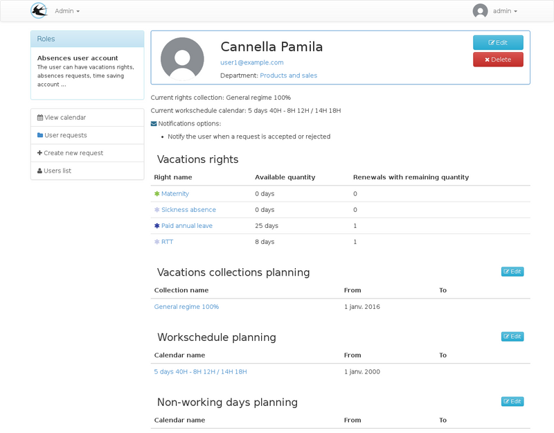
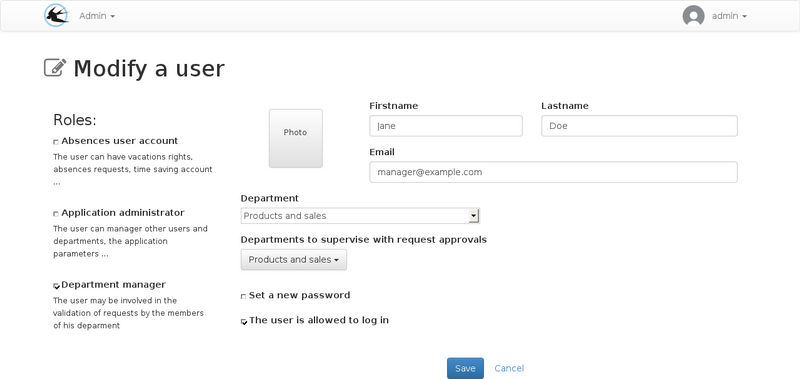
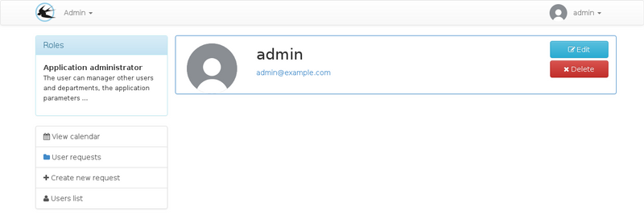
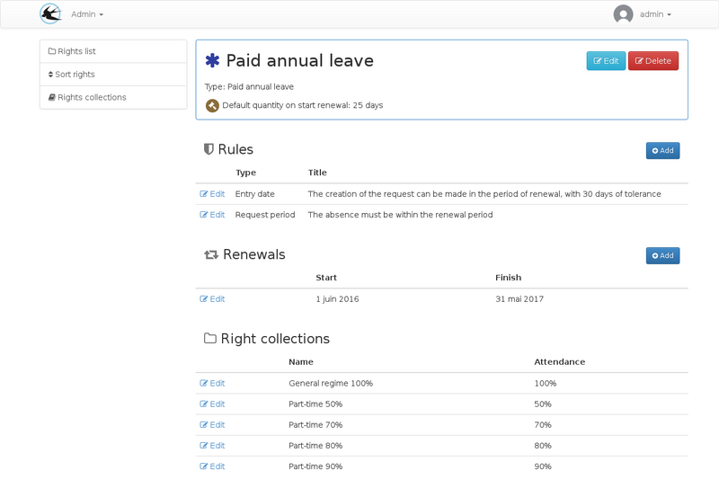

Title: "Administrator's Guide"
Layout: "doc"
ContentId: "doc-admin-guide"

---

Administrators are the people who can access the entire configuration. This documentation describes the management of rights, regimes, agendas, users, exports and the creation of absences instead of users.

<!-- more -->

## The users

### Creating a New User

### The roles

#### User account absences

Viewing a user, messages in red are the missing parameters of the configuration.

From the visualization sheet, it is possible to define the holiday regime,
The pace of work and the public holidays in force.
The quantities per right granted to users may be modified for individual cases.

For all these parameters, configurations must be made in the other menu if the proposed choices are insufficient.

You can consult the article on [parameter planning](010-planning-of-parameters.html).

Changing a user with an "absences" account

When the "User absences" box is checked, other options are visible on the form,
And this causes additional buttons to appear on the visulisation plug.

Additional fields available for this role:

* __Date of arrival__: This date is used by the application for the calculation of duties with addition to the balance every month. A standard plan can be associated with the user because the monthly balance additions will be effective only from that date.
* __Start date__: This date is used to determine whether a seniority right is visible or not.
* __User number SAGE__: This field is used only in the SAGE export, it allows to reconcile with the accounts of Sage pays during the monthly import of periods of absences.
* __The notification options__: Sets the emails sent. The user can change these settings when connected.

#### Head of Service

The role of the department head is to validate the requests for absences made by the members of his department.

A user may be responsible for several services, in which case he / she will have to approve requests from both services.

If a hierarchy of services is in place, approval will be at several levels. The service hierarchy is used only for approval of requests, so it is not necessary to set it up to represent the structure of the entity, it must be used to represent the struture of the desired approval. For example, if the human resources department must validate all absences, it must be placed at the top.

Viewing a user account manager:

Modification of a head of department:

When editing, the mutiple "Services to Supervise Requests for Approval" selection field determines where the person is responsible.

The service field that is available to all users will be used to determine who is the approver of that person.

#### Administrator

The persons designated by the role are represented in the company by the human resources department.
They will be able to manage absences and renewal periods

Editing a User with Only the Administrator Role

## Types

The rights types allow you to group absences between them.

The list of default types:

Creating or modifying a type of right:

When creating a request, the user must distribute the requested days on these leave rights. In the list, the rights are grouped by type.
The check box on the type allows you to change the default state of the rights of this type. Despite this option, all types can be folded and unfolded manually by the user. The option allows to hide by default the least important rights when there are many rights, for example, for recoveries, the number of rights depends on the number of requests for recoveries accepted beforehand.

## Rights

A right is a set of rules for assigning days of leave, on each rights,
One or more renewals can be created, they determine the allocation periods, at the beginning of each renewal, the balance is credited taking into account all the parameters of the right.

Depending on the parameters of the right, it is possible that the user can have access to several renewals at the same time when wishes used are day credit.

The list of rights:

From the visualization of a right, several elements can be parameterized:
* The amendment of the law
* Manage list of rules (allows to define the conditions that authorize the use of the balance, for more details, see the [documentation](007-rules-of-rights.html))
* Manage list of renewals
* View the list of related leave schemes, Plan / entitlement associations have been in effect since a plan was amended.

### Creating a right

TODO: screen for creating special rights

When creating a new right, it is possible to create special rights with, for example, a dynamic quantity depending on certain parameters.

In this case it is possible that the initial quantity is not visible or can not be modified subsequently because it will be calculated in a different way at each start of renewal.

### Right Options

| Field Name                  | Home                    |
|-----------------------------|-------------------------|
| Type                        | Rights types allow grouping of rights by category when creating leave requests |
| Default quantity            | This is the initial quantity of each renewal |
| Unity                       | The quantity can be in days or hours
| Quantity to be added every month | Required in the same unit as the default quantity, this field is used to define the amount automatically assigned on each first day of the month, for the entire renewal period. This addition will be made only for dates after the date of arrival in the company (user account field) |
| Active for                  | Determines who can create absences. For example for a right of absences due to illness, or may leave only the administrator to create absences |
| Automatic distribution      | The quantity to be distributed on the rights will automatically be allocated on this right without exceeding the quantity available and respecting the order of types and rights, if another right exists above with this option checked the balance of this right will be used in Priority |
| Require an Approval         | This option disables approval. This can be used for declaring sickness absence, in conjunction with the "Active for" option. |
| Use the default opening period | Unchecking this option extends the availability of the right based on the renewal start and end dates.                    |
| Allow deposits on the time savings account | Check if this right can be saved. |
| Quantity consumed for part-time plans | This option allows the choice of the rule of consumption of the balance for the partial times, for more information consult the [documentation](006-temps-partiels.html). |

### Renewals

From the right visualization sheet, you must add renewals so that the right can be accessed. All rights rules are based on renewal periods.

## Diets

A leave plan is a set of rights that can be associated with users.

A certain number of regimes are initialized during the installation of the application,
This list depends on the country of use.

New plans can be created in the case of a special leave plan.

The list of schemes:

Plan amendment form:

When creating a regime, additional fields can be entered:

| Field Name                   | Home                   |
|------------------------------|------------------------|
| The percentage of attendance | This indication is to be given for part-time schemes |
| Working days                 | Working days are used when calculating the number of days of RTT to be awarded |
| Working days of the collective agreement agreement | The number of days worked in the year will be used for the calculation of the number of RTTs |

## Requests

Different types of requests can be created by users and administrators.

### Leave requests

An absence request may be a leave request created by a user or an absence declared by an administrator
Such as sick leave.

Special case: The imposed leaves are also requests of absence created by the administrators. The
Only difference is that only the imposed holiday interface can be used for modification
Of this type of request. Despite this, they appear in the list of requests for both the user
And the administrator.

### Work Days Recovery Requests

### Deposit to the time savings account

## Leave of absence

Imposed leaves are created by administrators to assign the same period of absence to a given population of users.

It is a tool that allows to create periods of absence on several users at the same time with the following characteristics:

* Absences are already validated (no approval circuit)
* Only one leave entitlement is used per period.

The quantity consumed per user may vary depending on the work schedule.

## Exports

### Excel

There are two possible export types in excel format:

#### exporting requests

Exports one line per absence request. Applications must be included or straddling the period entered on the export form.

#### exporting balances

Exports one line per user and per right with an absence account.

The export form allows you to select a date. The quantities indicated in the various columns of the export correspond to the status of the application at the requested date.

### Sage

Exporting to the SAGE format allows you to import a file into payroll wage to complete the monthly pay slips with the holiday periods taken on the paid holidays type.

## The Agendas

### List of calendars

The administrator can set from this list a calendar set that can be used later on user accounts. The agendas are of 3 possible types:

* Holiday calendar
* Work Time Schedule
* Schedule of school holidays

### Additions / Changes to calendars

Example, modification of a work rhythm calendar present in the list provided initially:

To expand the list of default calendars, use the [icalendar](https://en.wikipedia.org/wiki/ICalendar) format and have a server to host ICS files so that they can be accessed on the Internet.

The [icalendar](https://en.wikipedia.org/wiki/ICalendar) format allows you to create calendars that contain complex repetition rules that allow you to meet all your requirements for the specification of your working rhythms .

You can use ICS files created from the google calendar using the [google calendar sharing feature](https://support.google.com/calendar/answer/37083). More information is available in the google help in the chapter "Share a link to your calendar using the calendar address", Gadael will be able to interpret your shared calendar in the same way as Make it outlook or another calendar application.

When creating a work rhythm calendar, two additional fields are visible:

* Half-day time
* The average number of hours per day

These parameters are used to convert the hours into days because the requests for absences are made in hours but the leave balances are most of the time in days, accurate to half a day.

