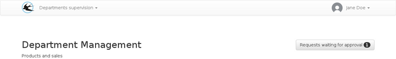

title: "Manager guide"
layout: "doc"
contentId: "doc-department-head"

---

The manger (department head) is the person in charge of a department, whose function is the validation of the requests made by the department members but also the supervision of the sub-departments if this has been configured.

<! - more ->

From the home page, the manager can view the schedule of the next days for the department members and the number of awaiting requests.

The roles of absence account user, department manager and administrator can be accumulated, in this case additional menus will be visible in the menu bar at the top of the page.

Most of the time, a department manager will also be a user with absence account.

## Pending requests

On the pending requests list, requests are grouped by user and ordered by creation date.

## Approval

Requests approval follows the hierarchy of departments, each manager must approve the requests of his department members but also the second stage of approval for the members of the sub-departments.

It is possible that the managed department does not contain any members, in this case there is no schedule on the home page, but the manager still have to assume the approval of sub-departments requests.

## The notifications

Managers are notified by email when a request is awaiting approval.
