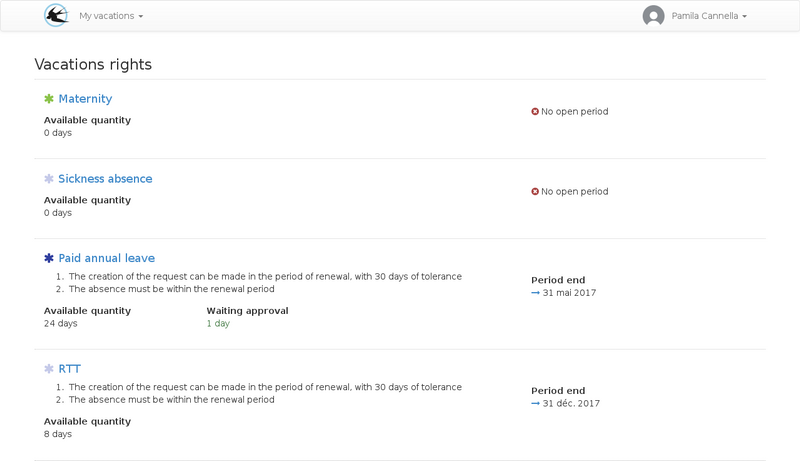
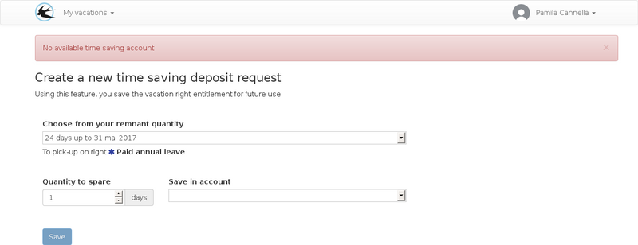

title: "User guide"
layout: "doc"
contentId: "doc-user-guide"

---

This documentation describes the role of the user. He can create leave requests, view his absence rights balance, make time saving account deposits or retrieve working time in the form of recovery absence right.

<! - more ->

## The home page

On the homepage, a summary of the available absence rights is displayed, followed by the list of members of my department with a schedule of availability over the next few days.

## The list of requests

From the requests list, you will be able to monitor the progress of the approvals on your already created requests.

## The calendar

The personal calendar allows you to view:

* Absences
* Working periods giving entitlement to recovery right
* Non working days

### Link to google calendar

If you use a google calendar account, you can automatically sync events from your personal account to a calendar on your google calendar account.

The parameterization of this functionality is carried out from the user menu > parameters

## My rights

The list of my rights makes it possible to visualize the use rules of each right that are assigned to me.

To see the details of the renewals, click on the name of the right.

This page makes it possible to consult any manual adjustments made by the administrators, this can be the case if the arrival in the company overlap the renewal period.

The adjustment history may also include automatic monthly balance additions for rights that accrue as the days are worked.

Automatic decreases in allowed right quantity may occur and will be visible on this page, for example decreases based on sick leave.

## The list of requests

Requests are ordered by the creation date, the most recent requests appear first. Several types of requests may appear in this list:

* Absences
* Deposits on the time savings account
* Recovery requests

Among the absences displayed, there may be leave requests created by you, mandatory absences created by administrators on a set of people or absences created by administrators only on your account (this type of absence can be handled by an approval).

## Create a leave request

A leave request is created in two steps.

1. The definition of the leave period
2. The distribution of the duration on the absence rights availables

### Definition of the leave period

First step, assisted by a planning view:

On the first step, the period is selected on a schedule containing the worked periods, the leaves already declared, and the non working days. The frieze below allows a comparison with the school holidays, this is visible only if administrator has configured it.

### Distribution of duration on leave rights

In the second step, the displayed table contains all the rights that can be used for the requested period. It is possible to a right to be displayed with several renewal periods, in this case it is advisable to consume the oldest balance because it will be brought to disappear sooner.

If a right is displayed with a less than zero balance, negative balances are allowed, this can be the case for leave without pay for example.

Further reading :

* [How to know what rights will be visible during a leave request?](011-faq.html#)
* [How to use a time saving account?](011-faq.html#)
* [How to use negative balances?](011-faq.html#)

## Create a Working Days Recovery Request

You can create recovery requests by declaring a working period outside of your work schedules.

The request will be sent for approval following the heads of departments validation scheme. If the request is accepted, an additional absence right will be created allowing you to use it on a leave period. The recoverable time periods are predefined by the administrator and validated by the approver which will not necessarily be identical to the declared overtime period.

Reporting interface for the worked period:

The amount of recuperated leave duration will depend on the choice made in the "Reclaimed Claim" drop-down list. The period of work declared on the schedule will justify this request to the approvers. The claimed recovery may be modified by the approvers if they consider that it is incorrect without the request being refused.

## Create a deposit on your time savings account

In order for this feature to be accessible, you must have a time-saving account right associated to your account. Only an administrator can activate a time saving account for users.

Time savings accounts are absence rights with a longer active renewal period span than regular paid leaves. They allow you to save unused leaves duration for future use.

To consult the use rules of your time savings account, you can use the "My rights" menu.

Deposits on the time savings account should be validated by the departments heads according to the same procedure as the other requests types.

The amount included in the requests for deposits on the time savings account pending approval is no longer usable in leave requests. Only a request refusal will free this quantity for normal use.
