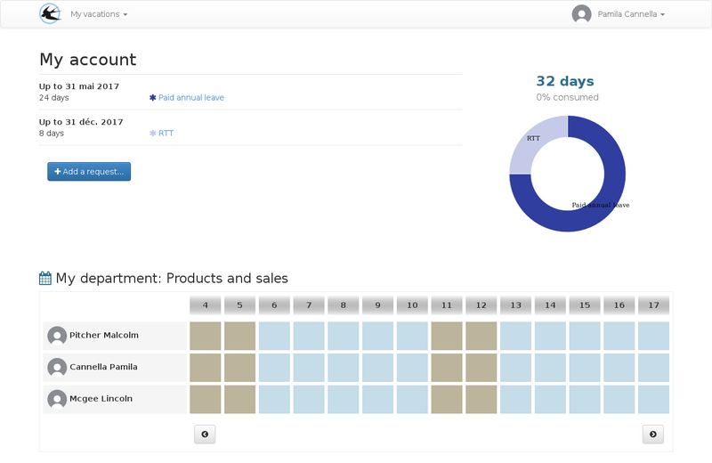
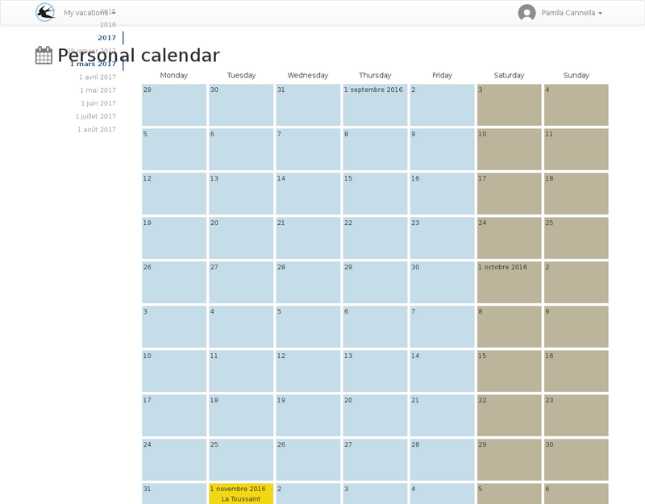
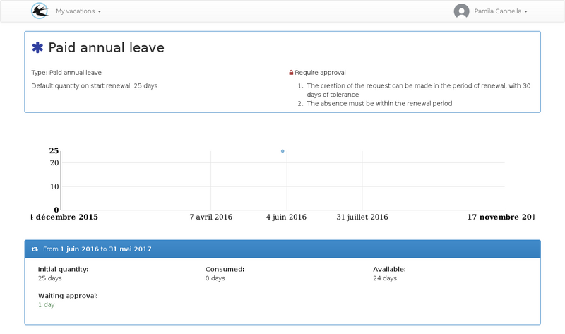
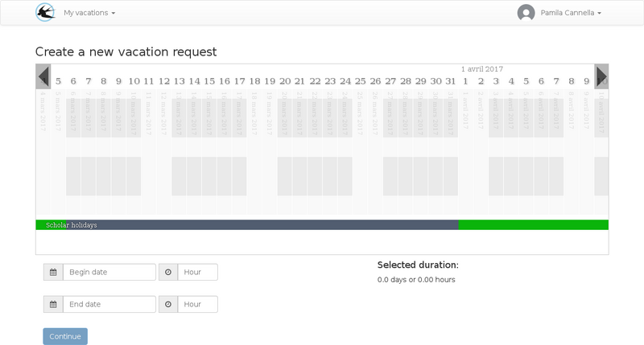

title: "User guide"
layout: "doc"
contentId: "doc-user-guide"

---

This documentation describes the role of the user. It can create leave requests, view the balance of entitlements, make deposits to the time savings account or retrieve working time in the form of leave entitlements.

<! - more ->

## The home page

On the homepage, a summary of the available rights is displayed, followed by the list of members of my service with a schedule of availability over the next few days.

## The list of requests

From the list of applications, you will be able to monitor the progress of the approvals of the applications already created.

## The agenda

The personal calendar allows you to view:

* Absences
* Working periods giving entitlement to recovery
* holidays

### Link to google calendar

If you use a google calendar account, you can automatically sync events from your personal account to a calendar on your google calendar account.

The parameterization of this functionality is carried out from the user menu> parameters

## My rights

The list of my rights makes it possible to visualize the rules of use of each right that are assigned to me.

To see the details of the renewals, click on the name of the right.

This page makes it possible to consult any manual adjustments made by the managers, this can be the case during an arrival in the company during the period.

The adjustment history may also include automatic monthly balance additions for rights that must accrue as the days are worked.

Automatic decreases in pay may occur and will be visible on this page, eg decreases in RTT based on sick leave.

## The list of requests

Applications are ordered by the creation date, the most recent requests appear first. Several types of requests may appear in this list:

* Absences
* Deposits on the time savings account
* Recovery requests

Among the absences displayed, there may be leave requests created by you, imposed absences created by managers on a set of people or absences created by managers only on your account (this type of absence can be handled by an approval).

## Create a leave request

A leave request is created in two steps.

1. The definition of the period of absence
2. The distribution of the duration on the leave rights available

### Definition of period of absence

First step, assisted by a planning view:

On the first step, the period is selected on a schedule containing the periods worked, the absences already declared, and the holidays. The frieze below allows a comparison with the school holidays.

### Distribution of duration on leave rights

In the second step, the displayed table contains all the rights that can be used for the requested period. It is possible to a right to be displayed with several renewal periods, in this case it is advisable to consume the oldest balance because it will be brought to disappear sooner.

If a right is displayed with a less than zero balance, negative balances are allowed, this can be the case for leave without pay for example.

Further reading :

* [How to know what rights will be visible during a leave request?](011-questions-answers.html#How-to-know-what-rights-who-will-be-visible % E2% 80% 99une-demand-of-conges)
* [How to use a time saving account?](011-questions-answers.html # How-to-use-a-time-saving-account)
* [How to use negative balances?](011-questions-answers.html # How-to-use-balances-negatives)
