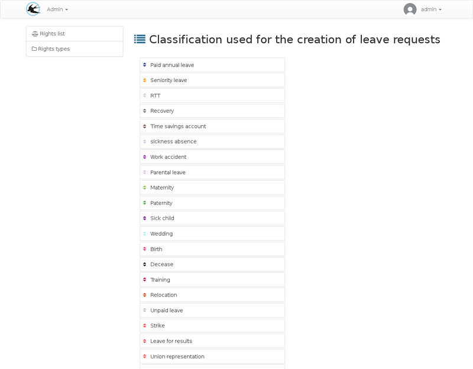

title: "Rights order"
layout: "doc"
contentId: "doc-rights-order"

---

The rights and types order role in the application.

<!-- more -->

The rights are sorted by the administrator during configuration,
This order will be used by the application to determine how rights are consumed when allocating it to the user's calendar.

Two steps are required, the first is to order the types as seen on the previous screenshot. For each type, the rights can be sorted. A second column appears when you click on a type to sort the type rights.
