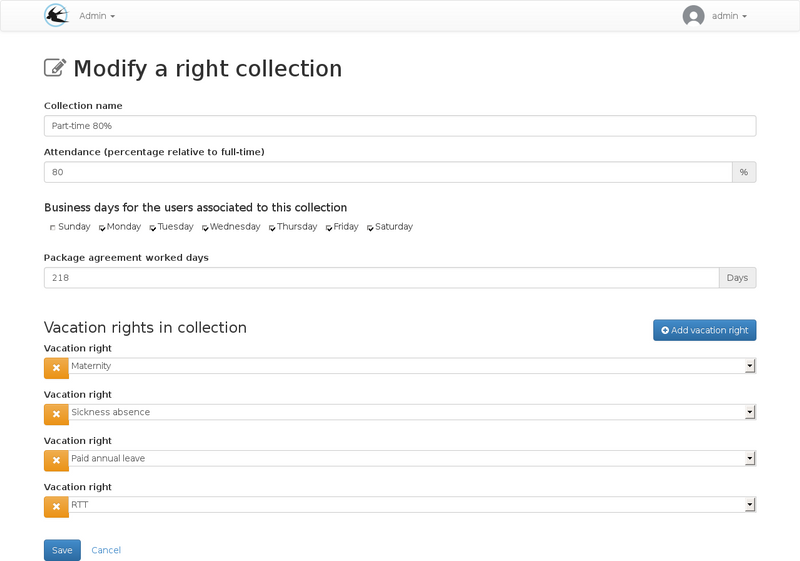

title: "Parts times collections"
layout: doc
contentId: "doc-parts-times"

---

For administrators, this document explains the specific configurations to be implemented for part-time right collections.

<!-- more -->

## General

Part-time collections can use the same entitlements as full-time collections. The calculation rules for the consumed quantity  will take into account a higher consumption. If you want that the the total available duration of the leave right visible for part-time users already takes into account Part-time with a proportional lower number of days, you will have to create some specific leave rights for each part-time percentage. In this case the following chapter should be ignored and the attendance 
percentage in right collection will be 100%.

The modification of a right collection with the attendance field:

## Rules for consumed time calculation

With these rules, one will obtain a consumed quantity greater than the number of days taken for usage by a part-time collection user.

### Proportionally to the attendance percentage

The consumed quantity is obtained with this formula:
Time consumed x (100 x (1 / attendance percentage))

Right collection setting:

Indicate an attendance percentage less than 100%

Right setting:

Indicate the "proportional to the attendance duration" consumption type 

Some examples :

* For a 50% right collection, a one day absence will consume 2 days on the balance.
* For a 75% right collection, a one day absence will consume 1.3 days.

### Depending on Business Days

Consumption is only for whole days, a began day is a consumed day, non-worked business days by part-time staff are counted as consumed.

Rights collection setting:

Check the business days associated with the right collection

Right setting:

Indicate the "Consume the following business days" consumption type 

Some examples :

For a right collection not worked on Friday

* An absence on Thursday morning (duration 0.5 days) will cause a consumption of 2 days on the leave balance.
* An absence on Thursday all day (duration 1 day) will cause a consumption of 2 days on the leave balance.
* An absence on Wednesday morning (duration 0.5 days) will cause a consumption of 1 day on the leave balance.
* An absence on Wednesday all day (duration 1 day) will cause a consumption of 1 day on the leave balance.

### Depending on worked days 

This calculation type rounds the rights consumption on whole days

Rights collection setting:

Set the number of worked days per year of the collective agreement.

Right setting:

Indicate the "Consume the following working days" consumption type 

Some examples :

For a right collection not worked on Friday

* An absence on Thursday morning (duration 0.5 days) will cause a consumption of 1 day on the leave balance.
* An absence on Thursday all day (duration 1 day) will cause a consumption of 1 day on the leave balance.
