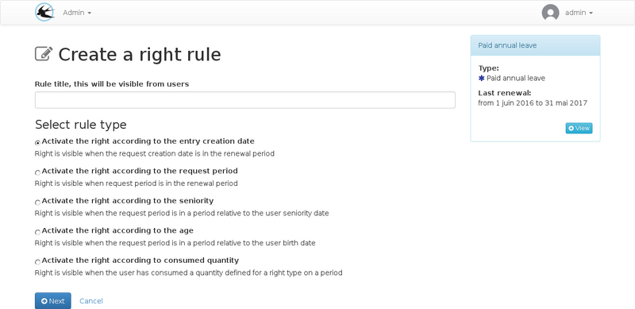

title: "The rights rules"
layout: doc
contentId: "doc-rights-rules"

---

For administrators, this document explains the rules that can be set on leave rights to determine when and how users can consume the balance that has been assigned to them.

<!-- more -->

## General

A user is granted a right if he is active and associated with the right collection. In this case it will appear on the list in the page "My rights".
A right granted allows the consultation of the balance and renewal periods.

For a right to be accessible to the user when creating an absence request, it is necessary that the role "user account absence" is checked in the "active for" field of the right and that the rules set defined on the right are respected.

The rules take account of both the user's parameters and the request parameters, and are used by the application once the leave requested period has been defined. The rules are used to filter the proposed rights list in the step of distributing the leave duration between the leave rights.

## Rules types

### Request creation date

This rule specifies that the request creation date must be within the renewal period. Parameters are used to create tolerance periods before or after.

It is recommended to use this type of rule in addition to a rule depending on the requested absence period as it does not allow to control when the leave will be taken.

For example, if only this type of rule is set up, it is possible to set a period of absence several years in advance.

### Requested absence period

This rule allows the requested absence period to be included in the renewal period. Parameters are used to create tolerance periods before or after.

This rule type is the most commonly used.

### Seniority

This rule makes it possible to make  a right available according to the age of the user. It is the requested period starting date which serves as a reference for the seniority date calculation (seniority on the first day of The absence).

Seniority is the number of years between the seniority start date set in the user's parameters and the request date. If the seniority start date is not set in the user record, this rule will never be valid.

This rule type allows you to define intervals for seniority, which makes it possible to create levels, for example:

* More than 20 years of service: 1 additional paid leave day
* 20 to 25 years of service: 2 additional paid leave days
* From 25 years of service: 3 additional paid leave days

### Age

This rule makes it possible to make available a right according to the age of the user.

The age is calculated with the user birth date on the first day of the requested absence period.
