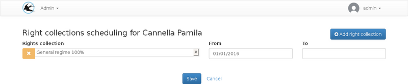
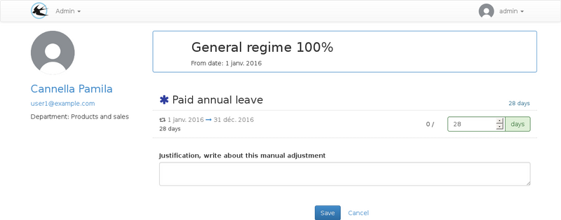
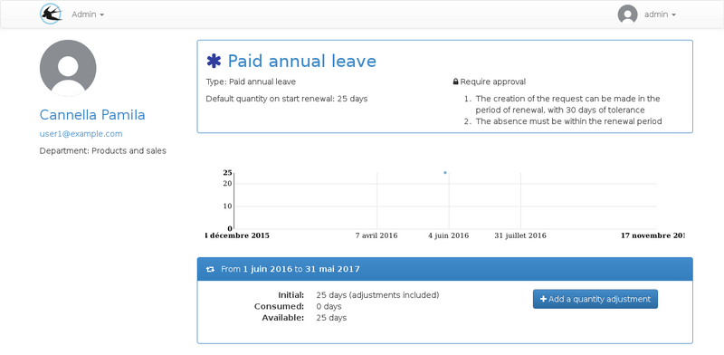
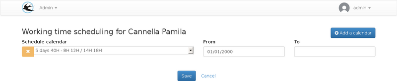
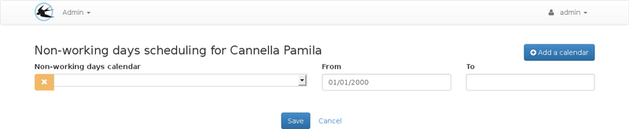

title: "Planning parameter"
layout: doc
contentId: "doc-planning-parameters"

---

This guide is intended for administrators to plan leave rights.

<!-- more -->

## Arrival in the company

### The arrival date

The arrival date in the company can be set on the user's edit form.

This date is used to:

* Ignore leave rights renewals completed prior to the user's arrival.
* Ingore the adjustments recorded before the arrival date.

For example, for fixed-term contracts, it is possible to use a paid leave right with an automatic quantity monthly increment the first day of the month. In this case, the monthly adjustments of the months preceding the arrival date will be ignored.

This parameter varies the initial quantity of the leave right distinctly for each user.

The arrival date can be modified on the user's form:

### Setting the start date of the right collection

You can access right collection planning from the viewing page.

Upon arrival of the user, it is necessary to create a line containing his right collection and only the start date of the allocation period.

The rights collection will be available from this date.

The end date will be useful only if it is desirable to define a date in advance or if the rights must no longer be available. This can be used to disable the user on a specific date.

### Changing the quantity

For rights credited per month or working days, the initial quantity must be changed to take into account the days worked on the first renewal.

For the rights credited per renewal period, the initial quantity parameterized on the right will be allocated therefore it is not necessary to make modifications.

From the user's record, click on the collection to change the quantities:

Saving the form will create adjustments on the concerned rights.

Adjustments can be viewed or added individually to the right page for the user only, this screen is accessible from the visualization sheet, in the list named "Absence rights":

## Change of rights collection

In the case of a collection modification, an end date must be set on the date range of the first collection and a new date range must be added for the new collection.

The end date of the new date range is not mandatory.

When several collection are associated with the user, the modification screen for quantities on renewals may be used to define the quantities on collections which are not yet available. Arrows are available next to the collection name to navigate to the next or previous collection.

## Changing work schedule

The work schedule planning can be accessed from the user's viewing page:

The list of calendars used on this page can be modified by the administrator from the "calendars" menu.

## Choice of non-working days calendar

The non-working days scheduling screen is accessible from the user's viewing page:

This screen may be used in the case of a change of law, in this case it will be necessary to modify the planning for all the users to switch to the new calendar of the holidays on a planned date.

In case the user is going to work in another country with different non working days only his / her card will have to be modified.

The list of calendars that can be used on this page can be modified by the administrator from the "calendars" topic.
