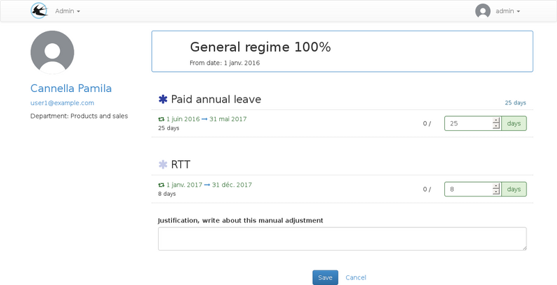
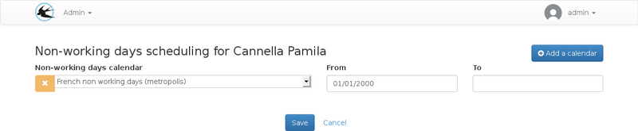

title: "Planning parameter"
layout: doc
contentId: "doc-planning-parameters"

---

This guide is intended for administrators to plan entitlements.

<!-- more -->

## Arrival in the company

### The date of arrival

The date of arrival in the company can be recorded on the user's card.

This date is used to:

* Ignore Renewals of vacation entitlements completed prior to the user's arrival.
* Ingorate the amount adjustment recorded before the arrival date.

For example, for fixed - term contracts, it is possible to use a right
Paid with a monthly increment of the automatic quantity the first
The day of the month. In this case, the monthly adjustments of the months preceding the date of arrival
Will be ignored.

This parameter varies the initial quantity of the duty distinctly for each
user.

The arrival date can be modified on the user's form:

### Setting the start date of the regime

You can access plan planning from the viewing form.

Upon arrival of the user, it is necessary to create a line containing his regime
And only the start date for the allocation period.

![Modify a user] (images/user-account-collections.png)

The plan fee will be available from this date.

The end date will be useful only if it is desirable to define in advance a date
Or the rights of the plan must no longer be available. This can
To disable the user on a specific date.

### Changing the quantity

For rights credited per month or working days, the initial quantity must be changed to take into account the days worked on the first renewal.

For the rights credited per renewal period, the initial quantity parameterized on the right will be allocated therefore it is not necessary to make modifications.

From the user's record, click on the plan to change the quantities:

The registration of form will create adjustments on the rights concerned.

Adjustments can be viewed or added individually to the form
Of the right for the user, this screen is accessible from the visualization sheet, in the table "Absence rights":

## Change of plan

In the case of a change of regime, an end date must be set on the date range of the first regime and a new date range must be added for the new regime.

The end date of the new date range is not mandatory.

When several regimes are associated with the user, the modification screen
Quantities on renewals may be used to define the quantities
On schemes which are not yet in force. Arrows are available next to the diet name to navigate to the next or previous diets.

## Changing work rhythm

The work schedule schedule can be accessed from the user's viewing form:

The list of calendars that can be used on this page can be modified by the administrator from the "calendars" topic.

## Choice of holiday calendar

The holiday scheduling screen is accessible from the user's viewing form:

This screen may be used in the case of a change of
Case it will be necessary to modify the planning for all the users to switch to the new calendar of the holidays.

In case the user is going to work in another country with different days only his / her card will have to be modified.

The list of calendars that can be used on this page can be modified by the administrator from the "calendars" topic.
