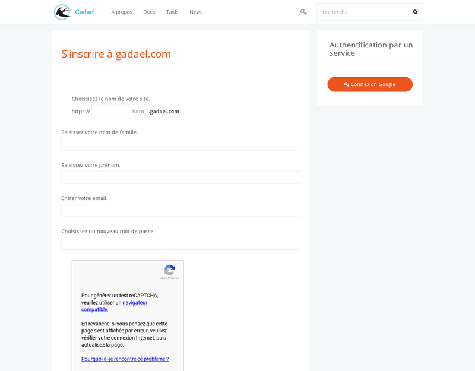
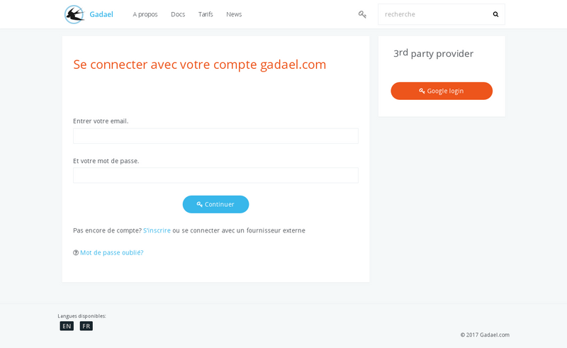
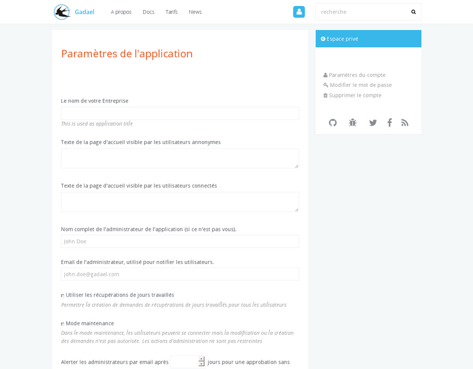

title: "Demarrage rapide"
layout: "doc"
contentId: "doc-quick-start"

---

Cette documentation concerne uniquement le service SAAS hébergé sur gadael.com. Contrairement aux autres pages de la documentation, ce qui est expliqué sur cette page ne peut pas être réalisé en utilisant le logiciel open source gadael s'il a été installé par vous même sur votre propre serveur.

<!-- more -->

## Introduction à Gadael.com

Cette documentation décrit la création d'une application hébergée sur gadael.com et que vous pourrez pour votre entreprise ou association dans la limite imposée par l'abonnement choisis (le nombre d'utilisateurs autorisés sur l'application dépend de l'abonnement).

Si vous gérez vous même votre propres serveur, il n'y a pas de limite dans le nombre d'utilisateurs actifs.

### Création d'un compte sur gadael.com

__Nom du site__

Le nom du site choisis ne doit pas contenir de caractères spéciaux ni d'espaces.

Après la création de votre compte, vous pourrez lancer votre application à l'aide du formulaire de paramétrage. Les autres options du compte ne sont pas accessibles tant que l'application n'est pas lancée.

Lors de la création de l'application, vous pourrez choisir un pays qui sera utlisé pour initialiser la base de donnés avec les principeaux droits de votre pays. Si votre pays ne se trouve pas dans la liste, vous pourrez créer votre application mais il n'y aura pas de droits par défaut, il faudra les créer manuellement.

### Options de l'administrateur

__Les récupérations de jours travaillés__

Cette fonctionalité peut être activée pour permettre aux employés de déclarer du temps travaillé sur une période habituellement non travaillée. Cette demande suivra un processus d'approbation qui permet a l'utilisateur de récupérer tout ou une partie de ce temps de travail sous la forme de droits de congés.

__Le mode maintenance__

Activer le mode maintenance peut être utilisé lors du paramétrage des droits de congés pour éviter que les utilisateur créent des demandes alors de la confirguration n'est pas terminée.

Le mode maintenance permet aux utilisateur de consulter leurs droit mais ne permet pas la création des demandes ni la modification.

## Votre application

### Création des comptes

Lors de la création de votre papplication, un compte administrateur à été créé automatiquement avec le même identifiant et mot de passe que sur le site gadael.com, vous pourrez utiliser ce compte pour accéder à votre application et créer d'autres comptes administrateurs.

Pour créer des comptes pour vos utilisateurs, vous pouvez utliser le menu administration  > utilisateurs. Il faut attribuer le rôle "compte utlisateur absences" pour que le compte puisse être rattaché à un régime de congés, pour plus d'informations sur les rôles, vous pouvez consulter [la documentation administrateur](002-guide-de-l-administrateur.html).

### Connexion en tant qu'utilisateur

Après avec créé un compte utlisateur et lui avoir attaché des droits, vous pouvez le tester en cliquant sur votre nom pour vous déconnecter, l'application vous proposera ensuite de vous authentifier à nouveau. Vous pourrez alors utiliser votre compte utilisateur pour vous connecter.

Pour plus d'informations sur les possibilitées de votre compte utilisateur, consultez [la documentation](004-guide-de-l-utilisateur.html).
