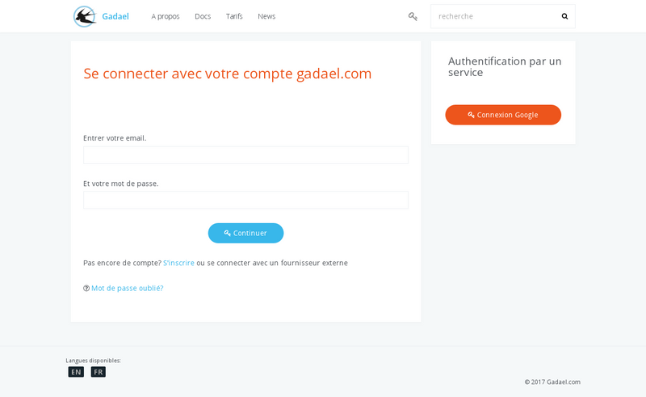

title: "Demarrage rapide"
layout: "doc"
contentId: "doc-quick-start"

---

## Introduction à Gadael.com

Cette documentation concerne uniquement le service SAAS hébergé sur gadael.com. COntrairement aux autres pages de la documentation, ce qui est expliqué sur cette page ne peut pas être réalisé en utilisant le logiciel open source gadael s'il a été installé par vous même sur votre propre serveur.

Cette documentation décrit la création d'une application hébergée sur gadael.com et que vous pourrez pour votre entreprise ou association dans la limite imposée par l'abonnement choisis (le nombre d'utilisateurs autorisés sur l'application dépend de l'abonnement).

Si vous gérez vous même votre propres serveur, il n'y a pas de limite dans le nombre d'utilisateurs actifs.

### Création d'un compte sur gadael.com

__Nom du site__

Le nom du site choisis ne doit pas contenir de caractères spéciaux ni d'espaces.

Après la création de votre compte, vous pourrez lancer votre application à l'aide du formulaire de paramétrage. Les autres options du compte ne sont pas accessibles tant que l'application n'est pas lancée.

### Options de l'administrateur

__Le mode maintenance__

Activer le mode maintenance peut être utilisé lors du paramétrage des droits de congés pour éviter que les utilisateur créent des demandes alors de la confirguration n'est pas terminée.

Le mode maintenance permet aux utilisateur de consulter leurs droit mais ne permet pas la création des demandes ni la modification.
