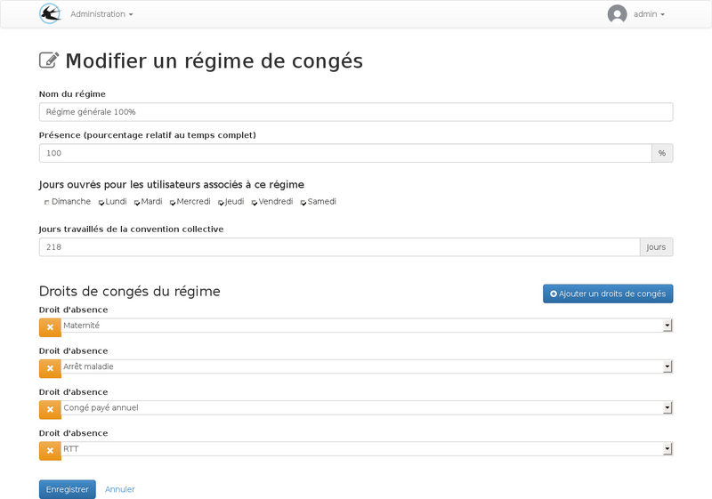
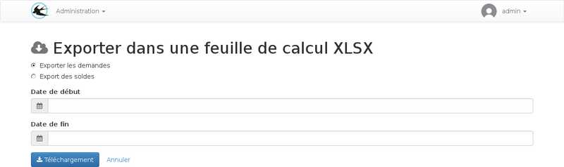
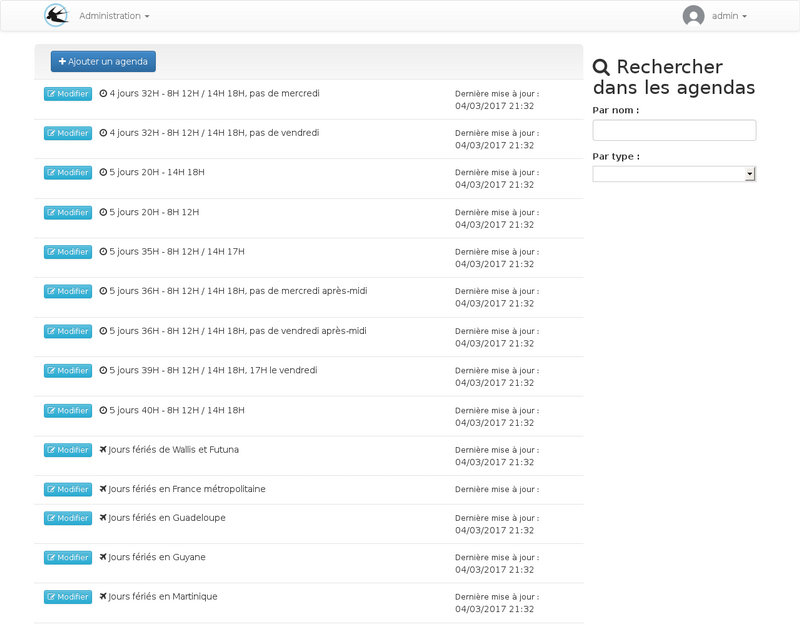

title: "Guide de l'administrateur"
layout: "doc"
contentId: "doc-admin-guide"

---

Les administrateurs sont les personnes qui pourront accéder à toute la configuration. Cette documentation décrit la gestion des droits, des régimes, des agendas, des utilisateurs, des exports et la création des périodes d'absence à la place des utilisateurs.

<!-- more -->

## Les utilisateurs

### Création d'un nouvel utilisateur

### Les rôles

#### Compte utilisateur absence

Visualisation d'un utilisateur, les messages en rouge sont les paramètres manquants de la configuration.

Depuis la fiche de visualisation, il est possible de définir le régime de congés,
le rythme de travail et les jours fériés en vigueur.
Les quantités par droit attribuées sur l'utilisateur peuvent être modifiées pour les cas particuliers.

Pour tous ces paramètres, des configurations doivent être faites dans les autres menus si les choix proposés sont insuffisants.

Vous pouvez consulter l'article concernant la [planification des paramètres](010-planification-des-parametres.html).

Modification d'un utilisateur ayant un compte "absences"

Lorsque la case "Compte utilisateur absence" est cochée, d'autres options sont visibles sur le formulaire,
et cela fait apparaitre des boutons supplémentaires sur la fiche de visualisation.

Champs supplémentaires disponibles pour ce rôle :

* __Date d'arrivée__ : Cette date est utilisée par l'application pour les calculs de droits avec ajout au solde tous les mois. Un régime standard peut être associé à l'utilisateur car les ajouts mensuels de solde serons effectifs uniquement à partir de cette date.
* __Date de début d'ancienneté__ : Cette date est utilisée pour déterminer si un droit d'ancienneté est visible ou non.
* __Numéro de matricule SAGE__ : Ce champ est utilisé uniquement dans l'export SAGE, il permet d'effectuer un rapprochement avec les comptes de Sage paie lors de l'import mensuel des périodes d'absences.
* __Les options de notification__ : Permet de paramétrer quels sont les emails envoyés. L'utilisateur peut lui même changer ces paramètres lorsqu'il est connecté.

#### Chef de service

Le rôle du chef de service est de valider les demandes d'absence effectuées par les membres de son service.

Un utilisateur peut être responsable de plusieurs services, dans ce cas il devra approuver les demandes en provenance des deux services.

Si une hiérarchie des services est mise en place, les approbations se feront à plusieurs niveau. La hiérarchie des services est utilisée uniquement pour l'approbation des demandes, il n'est donc pas nécessaire de la paramétrer pour représenter la structure de l'enreprise, il faut l'utiliser pour représenter la struture de l'approbation souhaitée. Par exemple si le service ressources humaines doit valider toutes les absences, il doit être placé en haut.

Visualisation d'un compte utilisateur chef de service :

Modification d'un chef de service :

Lors de la modification, le champ de sélection mutiple "Services à superviser lors des demandes d'approbation" permet de déterminer là ou la personne est responsable.

Le champ service qui lui est disonible pour tous les utilisateurs sera utilisé pour déterminer qui est l'approbateur de cette personne.

#### Administrateur

Les personnes désignées par ce rôle sont représentés dans l'enreprise par le service des ressources humaines.
Ils pourront gérer les droits d'absence et les périodes de renouvellement

Modification d'un utilisateur avec seulement le rôle administrateur

## Les types

Les types de droit permettent de regrouper des droits d'absence entre eux.

La liste des types proposés par défaut :

Création ou modification d'un type de droit :

Lors de la création d'une demande, l'utilisateur doit répartir les jours demandés sur ces droits de congé, dans la liste, les droits sont groupés par type.
La case à cocher sur le type permet de changer l'état par défaut des droits de ce type. Malgré cette option, tous les types peuvent êtres pliés et dépliés manuellement par l'utilisateur. L'option permet de cacher par défaut les droits les moins importants quand il peut y en avoir un grand nombre, par exemple, pour les récupérations, le nombre de droits dépend du nombre de demande de récupération acceptées au préalable.

## Les droits

Un droit est un ensemble de règles d'attribution de jours de congés, sur chaque droit,
un ou plusieurs renouvellements peuvent être créés, ils déterminent les périodes d'attribution, au début de chaque renouvellement, le solde est crédité en tenant compte de tous les paramètres du droit.

Suivant les paramètres du droit, il est possible que l'utilisateur puisse avoir accès à plusieurs renouvellements en même temps lorsqu'il souhaite utiliser son crédit de jour.

La liste des droits :

A partir de la visualisation d'un droit, plusieurs éléments sont paramétrables :
* La modification du droit
* Gérer la liste des règles (permet de définir les conditions qui autorisent l'utilisation du solde, pour plus de détails, consultez la [documentation](007-regles-des-droits.html))
* Gérer la liste des renouvellements
* Visualiser la liste des régimes de congé associés, Les associations régime/droits se font depuis la modification d'un régime.

### Création d'un droit

lors de la création d'un nouveau droit, il est possible de créer des droits spéciaux avec par exemple une quantité dynamique en fonction de certains paramètres.

Dans ce cas, il est possible que la quantité initiale ne soit pas visible ou pas modifiable par la suite car elle sera calculée d'une manière différente à chaque début de renouvellement.

### Options du droit

| Nom du champ                | Description            |
|-----------------------------|------------------------|
| Type                        | Les types de droit permettent de grouper les droits par catégorie lors de la création de demande de congés |
| Quantité par défaut         | Il s'agit de la quantité initiale de chaque  renouvellement |
| Unité                       | la quantité peut être en jour ou en heure
| Quantité à ajouter tous les mois | Obligatoirement dans la même unité que la quantité par défaut, ce champ permet de définir la quantité attribuée automatiquement chaque premier jour de mois, pendant toute la période du renouvellement. Cet ajout ne sera fait que pour les dates situées après la date d'arrivée dans l'entreprise (champ du compte utilisateur) |
| Actif pour                  | Permet de déterminer qui peut créer les demandes d'absence. Par exemple pour un droit d'absence pour maladie, ou pourra laisser uniquement l'administrateur créer les absences |
| Répartition automatique     | La quantité à distribuer sur les droits sera automatiquement attribuée sur ce droit sans dépassement de la quantité disponible et en respectant l'ordre des types et des droits, si un autre droit existe au dessus avec cette option cochée le solde de ce droit sera utilisé en priorité |
| Requiert une approbation    | Cette option permet de désactiver l'approbation. Cela peut être utilisé pour les déclarations d'absence maladie, conjointement avec l'option "Active pour". |
| Utiliser la période d'ouverture par défaut | Décocher cette option permet de restreindre la période possible de prise de congés par rapport à la date de la demande. Par exemple pour être sûr que les demandes sont faites au moins 30 jours avant la date de début du congé |
| Permettre les dépôts sur le compte épargne temps | A cocher si ce droit peut être épargné.
| Quantité consommée pour les régimes temps partiel | Cette option permet le choix de la règle de consommation du solde pour les temps partiels, pour plus d'informations consulter la [documentation](006-temps-partiels.html).

### Les renouvellements

Depuis la fiche de visualisation d'un droit, il faut ajouter des renouvellements pour que le droit puisse être accessible. Toutes les règles du droit sont basées sur les périodes de renouvellement.

## Les régimes

Un régime de congés est un ensemble de droits qui peut être associé aux utilisateurs.

Un certain nombre de régimes sont initialisés lors de l'installation de l'application,
cette liste dépend du pays d'utilisation.

Des nouveaux régimes peuvent êtres créés en cas de régime de congé particulier.

La liste des régimes :

Formulaire de modification d'un régime :

Lors de la création d'un régime, des champs complémentaires peuvent être renseignés :

| Nom du champ                | Description            |
|-----------------------------|------------------------|
| Le pourcentage de présence  | Cette indication est à donner pour les régimes de temps partiel  |
| Les jours ouvrés            | Les jours ouvrés sont utilisés lors du calcul du nombre de jours de RTT à attribuer  |
| jours travaillés de l'accord de la convention collective | Le nombre de jours travaillés dans l'année, il sera utilisé pour le calcul du nombre de RTT |

## Les demandes

Différents types de demande peuvent être créés par les utilisateurs et les administrateurs.

### Demande de congé

Une demande d'absence peut être une demande de congés créée par un utilisateur ou une absence déclarée par un administrateur
comme par exemple un congé maladie.

Cas particulier : Les congés imposés sont aussi des demandes d'absence créées par les administrateurs. La
seule différence est que seule l'interface des congés imposés peut être utilisée pour la modification
de ce type de demande. Malgré cela, ils apparaissent dans les listes des demandes à la fois pour l'utilisateur
et l'administrateur.

### Demande de récupération de jours travaillés

### Dépôt sur le compte épargne temps

## Congés imposés

Les congés imposés sont créés par les administrateurs pour attribuer la même période d'absence à une population d'utilisateurs donnée.

C'est un outil qui permet de créer des périodes d'absence sur plusieurs utilisateurs à la fois avec les caractéristiques suivantes :

* les absences sont déjà validées (pas de circuit d'approbation)
* un seul droit de congé est utilisé par période.

La quantité consommée par utilisateur peut varier en fonction du planning de travail.

## Les exports

### Excel

Il existe deux types d'export possible au format excel :

#### l'export des demandes

Exporte une ligne par demande d'absence. Les demandes doivent être incluses ou à cheval sur la période saisie sur le formulaire d'export.

#### l'export des soldes

Exporte une ligne par droit et par utilisateur avec un compte absence.

Le formulaire d'export permet de sélectionner une date. les quantité indiquées dans les différentes colonnes de l'export corespondronts à l'état de l'application à la date demandée.

### Sage

L'export au format SAGE permet d'importer un fichier dans sage paie pour compléter les fiches de paie du mois avec les périodes de congés prises sur le type congés payés.

## Les Agendas

### Liste des agendas

L'administrateur peut paramétrer depuis cette liste un ensemble d'agendas qui pourront être utilisés par la suite sur les comptes utilisateur. Les agendas sont de 3 types possibles :

* Agenda de jours fériés
* Agenda de rythme de travail
* Agenda des vacances scolaires

### Ajouts/Modifications d'agenda

Exemple, modification d'un agenda de rythme de travail présent dans la liste fournie initialement :

Pour étendre la liste des agendas proposés par défaut, il faudra utiliser le format [icalendar](https://fr.wikipedia.org/wiki/ICalendar) et disposer d'un serveur pour héberger des fichiers ICS pour qu'ils soient accessibles sur internet.

Le format [icalendar](https://fr.wikipedia.org/wiki/ICalendar) permet de créer des agendas contenant des règles de répétition complexes qui permettrons de répondre a l'ensemble de vos besoins pour la spécifications de vos rythmes de travail.

Il est possible d'utiliser des fichiers ICS créés depuis google agenda en utilisant la fonction de [partage de google agenda](https://support.google.com/calendar/answer/37083). Plus d'informations sont disponbles dans l'aide de google dans le chapitre "Partager un lien vers votre agenda à l'aide de l'adresse de l'agenda", Gadael sera capable d'interpréter votre agenda partagé de la même façon que le ferait outlook ou une autre application d'agenda.

Lors de la création d'un agenda de rythme de travail, deux champs supplémentaires sont visibles :
* l'heure de la demi-journée
* le nombre d'heure moyen d'une journée

Ces paramètres sont utilisés pour convertir les heures en jours car les demandes d'absence sont effectuées en heures mais les soldes de congés sont la plupart du temps en jours, précis à la demi-journée.
