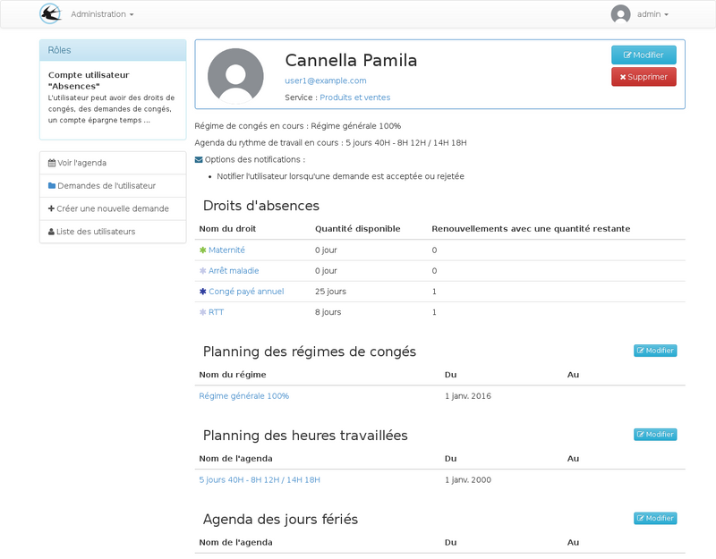
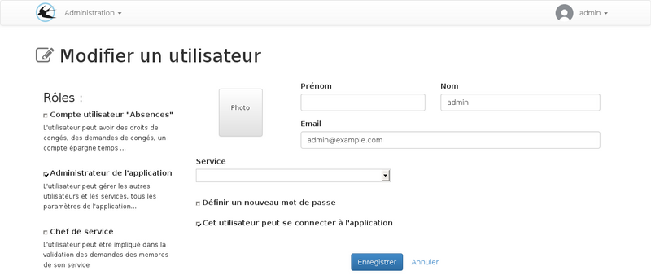
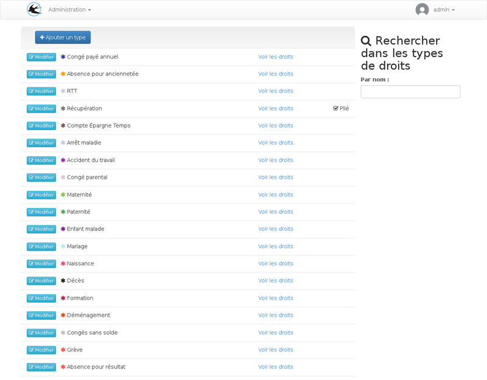

title: "Guide de l'administrateur"
layout: "doc"

---

## Les utilisateurs

### Création d'un nouvel utilisateur

### Les rôles

#### Compte utilisateur absences

Visualisation d'un utilisateur, les messages en rouge sont les paramètre manquants de la configuration.

Modification d'un utilisateur ayant un compte "absences"

Lorsque cette case est cochée, d'autres options sont visibles, l'utilisteur peut être associé à un régime de congés

Champs supplémentaires disponibles pour ce rôle :

* __Date d'arrivée__ : Cette date est utilisée par l'application pour les calcul de droits avec ajout au solde tous les mois. Un régime standard peut être associé à l'utilisateur car les ajouts mensuels de solde serons effectifs uniquement à partir de cette date.
* __Date de début d'anciennetée__ : Cette date est utilisée pour déterminer si un droit d'anciennetée est visible ou non.
* __Numéro de matricule SAGE__ : Ce champ est utilisé uniquement dans l'export SAGE, il permettre d'effectuer un rapprochement avec les comptes de Sage paie lors de l'import mensuel des périodes d'absences.
* __Les options de notification__ : Permet de paramétrer quels sont les emails envoyés. L'utilisateur peut lui même changer ces paramètres lorsqu'il est connecté.

#### Chef de service

Le rôle du chef de service est de valider les demandes d'absences effectuées par les membres de son service.

Un utilisateur peut être responsable de plusieurs services, dans ce cas il devra approuver les demandes en provenance des deux services.

Si une hiérarchie des services est mise en place, les approbation se ferons à plusieurs niveau. La hiérarchie des services est utilisée uniquement pour l'approbation des demandes, il n'est donc pas nécessaire de la paramétrer pour représenter la structure de l'enreprise, il faut l'utiliser pour représenter la struture de l'approbation souhaitée. Par exemple si le service resources humaines doit valider toutes les absences, il doit être placé en haut.

Visualisation d'un compte utilisateur chef de service :

Modification d'un chef de service :

Lors de la modification, le champ de sélection mutiple "Services à superviser lors des demandes d'approbation" permet de déterminer là ou la personne est responsable.

Le champ service qui lui est disonible pour tous les utilisateurs sera utilisé pour déterminer qui est l'approbateur de cette personne.

#### Administrateur

Les personnes désignées par se rôle sont représenté dans l'enreprise par le service des ressources humaines.
Ils pourrons gérer les droits d'absence et les périodes de renouvellements

Modification d'un utilisateur avec seulement le rôle administrateur

## Les types

Les types de droits permettent de regrouper des droits d'absence entre eux.

La liste des types proposés par défaut :

Création ou modification d'un type de droit :

Lors de la création d'une demande, l'utilisateur doit répartir les jours demandés sur ces droits de congés, dans la liste, les droits sont groupés par types.
La case a cocher sur le type permet de changer l'état par défaut des droits de ce type. Malgré cette option, tous les types peuvent êtres pliés et dépliés manuellement par l'utilisateur. L'option permet de cacher par défault les droits les moins important quand il peut y en avoir un grand nombre, par example, pour les récupérations, le nombre de droits dépend du nombre de demandes de récupérations acceptées au préalable.

## Les droits

### Options du droit

### les règles d'affichage

## Les régimes

Un régime de congés est un ensemble de droits qui peut être associé aux utilisateur.

## Les demandes

Différents types de demandes peuvent être créés par les utilisateur et les administrateurs.

### Demandes de congé

Une demande d'absence peut être une demande de congés créer par un utilisateur ou une absence déclarée par un administrateur
comme par exemple un congé maladie.

Cas particulier : Les congés imposés sont aussi des demandes d'absence créées par les administrateur. La
seule différence est que seul l'interface des congés imposé peut être utilisée pour la modification
de ce type de demande. Malgré cela, ils apparaissent dans les liste des demandes à la fois pour l'utilisateur
et l'administrateur.

### Demandes de récupération de jours travaillés

### Dépôt sur le compte épargne temps

## Congés imposés

Les congés imposés sont créés par les administrateurs pour attribuer la même période d'absence à une population d'utilisateurs donnée.

## Les exports

### Excel

### Sage
