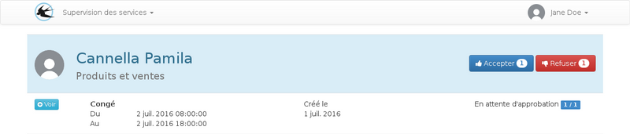

title: "Guide du chef de service"
layout: "doc"

---

Depuis la page d'accueil, le gestionnaire peut consulter le planning des prochains jours pour les membres de son service et le nombre de demande en attente d'approbation.

## Les demandes en attente

Sur la liste des demandes en attente, les demandes sont groupées par utilisateur et ordonnées par date de création.

## l'approbation

L'approbation des demandes suis la hiérarchie des services, chaque responsable de service doit approuver les demandes des membres de son service mais aussi la deuxième étape de l'approbation pour les membres des sous-services.

Il est possible que le service administré ne contiennent aucun membre, dans ce cas il n'y a pas de planning sur la page d'acceuil mais le responsable doit quand même assumer l'approbation des demandes provenant des sous-services.

## Les notifications

Les responsables sont notifiés par email lorqu'une demande est en attente d'approbation.
