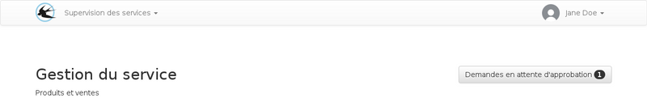

title: "Guide du chef de service"
layout: "doc"

---

Depuis la page d'accueil, le gestionnaire peut consulter le planning des prochains jours pour les membres de son service et le nombre de demande en attente d'approbation.

## Les demandes en attente

Sur la liste des demandes en attente, les demandes sont groupées par utilisateur et ordonnées par date de création.

## Les notifications

TODO
