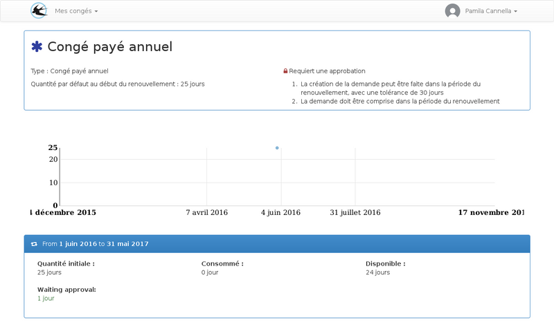
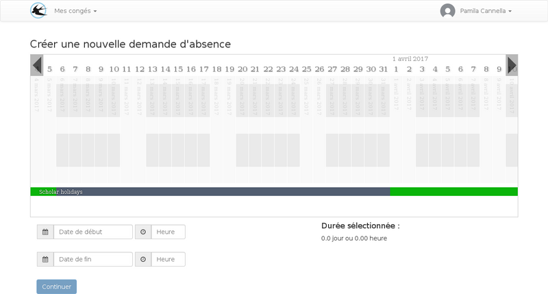

title: "Guide de l'utilisateur"
layout: "doc"

---

## La liste des demandes

## L'agenda

L'agenda personel permet de visualiser :

* Les absences
* les périodes de travail donnant droit a récupération
* les jours fériés

### Lien avec l'agenda google

Si vous utilisez un compte google calendar, il est possible de synchroniser automatiquement les événements de votre compte personel dans un agenda de votre compte google calendar.

Le paramétrage de cette fonctionnalité s'effectue depuis le menu utilisateur > paramètres

## Mes droits

La liste de mes droits permet de visualiser les règles d'utilisations de chaque droits qui me sont attribués.

Pour visualiser le détail des renouvellement, il faut cliquer sur le nom du droit.

Cette page permet de consulter les éventuels ajustements manuels effectuées par les gestionnaires, cela peut être le cas lors d'une arrivée dans l'entreprise en cours de période.

L'historique des ajustements peut aussi contenir des ajouts  menuelles automatique de solde pour les droits qui doivent dont la quantité est aquise au fur et a mesure des jours travaillés.

Des diminution automatique de solde peuvent se produire et serons visible sur cette page, par exemple les diminution de RTT en fonction des arrêts maladie.

## La liste des demandes

Les demandes sont ordonnées par la date de création, les demandes les plus récentes appraissent en premier. Plusieurs types de demandes peuvent apparaitres dans cette liste :

* Les absences
* Les dépôts sur le compte épargne temps
* Les demandes de récupération

Parmis les absences affichées, il peut y avoir des demandes de congés crées par vous, des absences imposées crées par les gestionnaires sur un ensemble de personnes ou des absences crées par les gestionnaires uniquement sur votre compte (ce type d'absence peut être traitée par une approbation).

## Créer une demande congés

Une demande de congés se crée en deux étape.

1. La définition de la période d'absence
2. La répartition de la durée sur les droits de congés disponibles

### Définition de la période d'absence

Première étape, assistée par une vue planning :

Sur la première étape, la période est sélectionnée sur un planing contenant les périodes travaillées, les absences déjà déclarées, et les jours fériés. La frise située en dessous permet une comparaison avec les périodes de vacances scolaires.

### Répartition de la durée sur les droits de congés

Lors de la deuxième étape, le tableau affichée contient tous les droits qui peuvent être utilisés pour la période demandée. Il est possible d'un droit soit affiché avec plusieurs périodes de renouvellement, dans ce cas il est conseillé de consommé le solde le plus ancien car il sera amené à disparaitre plus tôt.

Si un droit est affiché avec un solde à zéro, c'est que les soldes négatifs sont autorisés, cela peut être le cas pour les congés sans solde par example.

TODO: ajouter des liens vers la FAQ

comment connaitre les règles d'affichage dans cette liste?
comment utiliser mon compte épargne temps?
comment utiliser les soldes négatifs?

## Créer une demande de récupération de jours travaillés

Vous pouvez créer des demandes de récupération, pour cela, il faut déclarer une période travaillée située en dehors de ces horaires de travail.

La demande sera envoyée en approbation en suivant le schéma de validation des chefs de services. Si la demande est validée, un droit suplémentaire sera créé pour l'utilisateur lui permettant d'utiliser en congés une durée prédéfinie par l'administrateur et validée par l'approbateur qui ne sera pas nécéssairement identique à la période de travail suplémentaire déclarée.

Interface de déclaration de la période travaillée :

## Créer un dépôt sur le compte épargne temps

