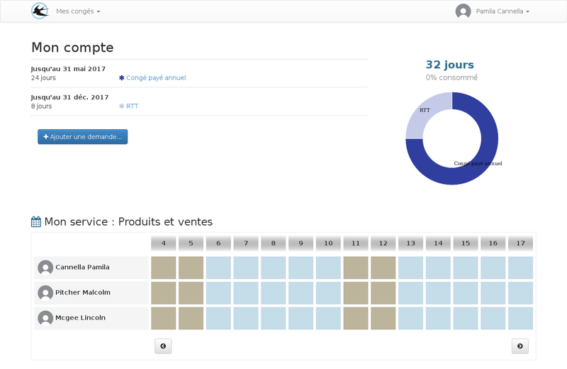
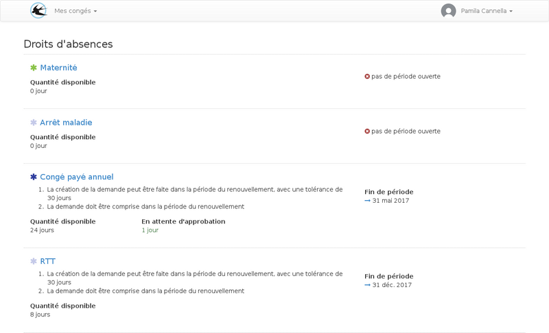

title: "Guide de l'utilisateur"
layout: "doc"
contentId: "doc-user-guide"

---

Cette documentation décrit le rôle de l'utilisateur. Il peut créer des demandes de congés, consulter le solde des droits, effectuer des dépôts sur le compte épargne temps ou récupérer du temps de travail sous la forme de droits de congés.

<!-- more -->

## La page d'accueil

Sur la page d'accueil, un résumé des droits disponible est affiché, suivi de la liste des membres de mon service avec un planning des disponiblité sur les prochains jours.

## La liste des demandes

Depuis la liste des demandes, vous pourrez surveiller l'avancement de l'approbations des des demandes déjà crées.

## L'agenda

L'agenda personel permet de visualiser :

* Les absences
* les périodes de travail donnant droit a récupération
* les jours fériés

### Lien avec l'agenda google

Si vous utilisez un compte google calendar, il est possible de synchroniser automatiquement les événements de votre compte personnel dans un agenda de votre compte google calendar.

Le paramétrage de cette fonctionnalité s'effectue depuis le menu utilisateur > paramètres

## Mes droits

La liste de mes droits permet de visualiser les règles d'utilisation de chaque droit qui me sont attribuées.

Pour visualiser le détail des renouvellements, il faut cliquer sur le nom du droit.

Cette page permet de consulter les éventuels ajustements manuels effectués par les gestionnaires, cela peut être le cas lors d'une arrivée dans l'entreprise en cours de période.

L'historique des ajustements peut aussi contenir des ajouts mensuels automatiques de solde pour les droits qui doivent dont la quantité est acquise au fur et à mesure des jours travaillés.

Des diminutions automatiques de solde peuvent se produire et seront visibles sur cette page, par exemple les diminutions de RTT en fonction des arrêts maladie.

## La liste des demandes

Les demandes sont ordonnées par la date de création, les demandes les plus récentes apparaissent en premier. Plusieurs types de demandes peuvent apparaitres dans cette liste :

* Les absences
* Les dépôts sur le compte épargne temps
* Les demandes de récupération

Parmi les absences affichées, il peut y avoir des demandes de congés créés par vous, des absences imposées créées par les gestionnaires sur un ensemble de personnes ou des absences créées par les gestionnaires uniquement sur votre compte (ce type d'absence peut être traitée par une approbation).

## Créer une demande congés

Une demande de congés se crée en deux étapes.

1. La définition de la période d'absence
2. La répartition de la durée sur les droits de congés disponibles

### Définition de la période d'absence

Première étape, assistée par une vue planning :

Sur la première étape, la période est sélectionnée sur un planning contenant les périodes travaillées, les absences déjà déclarées, et les jours fériés. La frise située en dessous permet une comparaison avec les périodes de vacances scolaires.

### Répartition de la durée sur les droits de congés

Lors de la deuxième étape, le tableau affiché contient tous les droits qui peuvent être utilisés pour la période demandée. Il est possible d'un droit soit affiché avec plusieurs périodes de renouvellement, dans ce cas il est conseillé de consommer le solde le plus ancien car il sera amené à disparaitre plus tôt.

Si un droit est affiché avec un solde à zéro, c'est que les soldes négatifs sont autorisés, cela peut être le cas pour les congés sans solde par exemple.

TODO: ajouter des liens vers la FAQ

comment connaître les règles d'affichage dans cette liste?
comment utiliser mon compte épargne temps?
comment utiliser les soldes négatifs?

## Créer une demande de récupération de jours travaillés

Vous pouvez créer des demandes de récupération, pour cela, il faut déclarer une période travaillée située en dehors de ces horaires de travail.

La demande sera envoyée en approbation en suivant le schéma de validation des chefs de service. Si la demande est validée, un droit supplémentaire sera créé pour l'utilisateur lui permettant d'utiliser en congés une durée prédéfinie par l'administrateur et validée par l'approbateur qui ne sera pas nécessairement identique à la période de travail supplémentaire déclarée.

Interface de déclaration de la période travaillée :

La quantité de congés récupérés dépendra du choix effectué dans la liste déroulante "Récupération revendiquée". La période de travail déclarée sur le planning permettra de justifier cette demande auprès des approbateurs, La récupération revendiquée pourra être modifiée par les approbateurs s'ils estiment qu'elle est incorrecte sans pour autant que la demande soit refusée.

## Créer un dépôt sur le compte épargne temps

Pour que cette fonctionnalité soit accessible, il faut qu'un droit de compte épargen temps soit actif pour votre compte. Seul un administrateur pourra activer un compte épargne temps pour les utilisateurs.

Les comptes épargne temps sont des droits de congés avec une durée d'utilisation plus longue que les périodes de renouvellement des congés payés classiques. Ils permettent d'épargner ces congés non utilisés pour une utilisation ultérieure.

Pour consulter les règles d'utilisation de votre compte épargne temps, vous pouvez utiliser le menu "Mes droits".

Les dépôts sur le compte épargne temps devrois être validée par les chefs de services selon le même procédé que les autres types de demande.

La quantité incluse dans les demandes de dépôts sur le compte épargne temps en attente d'approbation n'est plus utilisable dans demandes de congés. Seul un refus de la demande permettra de récupérer cette quantité pour une utilisation normale.
