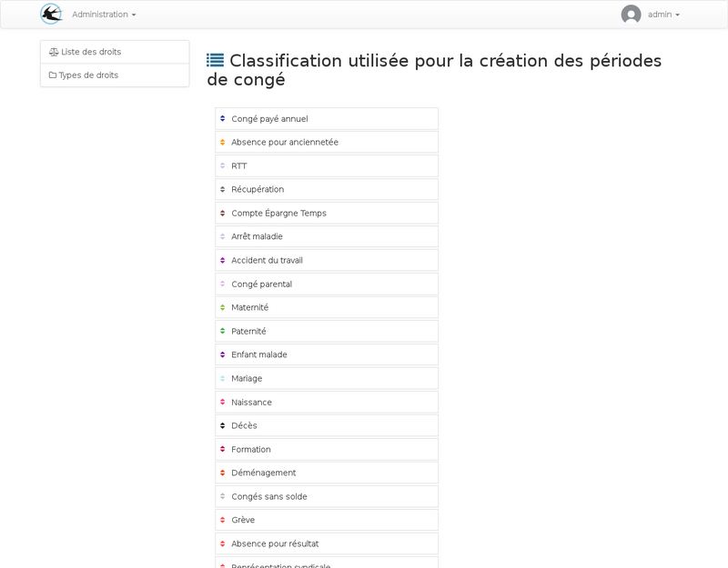

title: L'ordre des droits
layout: doc
---

Les droits sont triés par l'administrateur lors de la configuration,
cet ordre sera utilisé par l'application pour déterminer comment sont
consommés les droits lors de la répartition sur le calendrier de l'utilisateur.

Deux étapes sont nécessaires, la première consiste à ordonner les types comme vu sur la capture d'écran précédente. Pour chaque type, les droits peuvent être ordonnés. Une deuxième colonne apparait lorsqu'on clique sur un type pour ordonner les droits du type.
