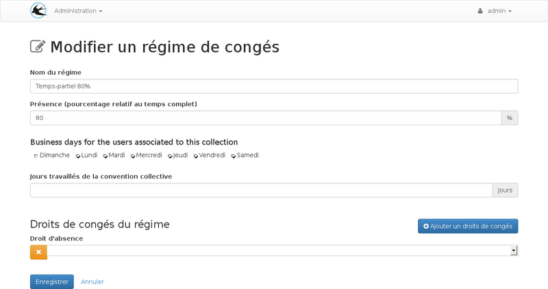

title: "Régimes temps-partiels"
layout: doc
contentId: "doc-parts-times"

---

A l'intention des administrateurs, ce document explique les configurations spécifiques à mettre en place pour les régimes à temps partiels.

<!-- more -->

## Généralités

Les régimes temps partiels peuvent utiliser les mêmes droits que les régimes de temps plein. Les
règles de calcul de la quantité consommée prendrons en compte un consommation suppérieure. Si on souhaite
que la durée totale du droit de congés affiché pour les utilisateurs à temps partiel prenne déjà en compte
le temps partiel avec un nombre de jours inférieur proportionnel, il faudra pour cela créer des droits
différents, le chapitre suivant devra être ignoré dans ce cas et les régimes devront contenir un
pourcentage de présence égale à 100%.

## Règles de calcul du temps consommé

Avec ces règles de calcul, on obtiendra une quantité consommée supérieure au nombre de jours pris lors
d'une utilisation pour un régime temps partiel.

### Proportionellement au pourcentage de présence

La quantité consommée est obtenue avec la formule
durée consommée x (100 x (1/pourcentage de présence))

Paramètre du régime :

Indiquer un pourcentage de présence inférieur à 100%

Paramètre du droit :

Indiquer le type de consommation "proportionnel au temps de présence"

Quelques exemples :

* Pour un régime a 50% une absence de une journée va consommer 2 jours sur le solde.
* Pour un régime a 75% une absence de une journée va consommer 1,3 jours.

### Selon les Jours ouvrés

La consommation se fait uniquement sur des jours entiers, un jour entamé est un jour consommé, les
jours ouvrés non travaillés par le personnel à temps partiel sont comptabilisés comme consommé.

Paramètre du régime :

Cocher les jours ouvrés associés au régime

Paramètre du droit :

Indiquer le type de consommation "Consommer les jours ouvrés suivants"

Quelques exemples :

Pour un régime non travaillé le vendredi

* Une absence le jeudi matin (durée 0,5 jour) va provoquer une consomation de 2 jours sur le solde de congés.
* Une absence le jeudi toute la journée (durée 1 jour) va provoquer une consomation de 2 jours sur le solde de congés.
* Une absence le mercredi matin (durée 0,5 jour) va provoquer une consomation de 1 jour sur le solde de congés.
* Une absence le mercredi toute la journée (durée 1 jour) va provoquer une consomation de 1 jour sur le solde de congés.

### Selon les jours travaillés

Ce type de calcul arrondit la consommation du droit aux jours entiers

Paramètre du régime :

indiquer le nombre de jours travaillés annuel de la convention collective.

Paramètre du droit :

indiquer le type de consommation "Consommer les jours travaillés suivants"

Quelques exemples :

Pour un régime non travaillé le vendredi

* Une absence le jeudi matin (durée 0,5 jour) va provoquer une consomation de 1 jour sur le solde de congés.
* Une absence le jeudi toute la journée (durée 1 jour) va provoquer une consomation de 1 jour sur le solde de congés.
