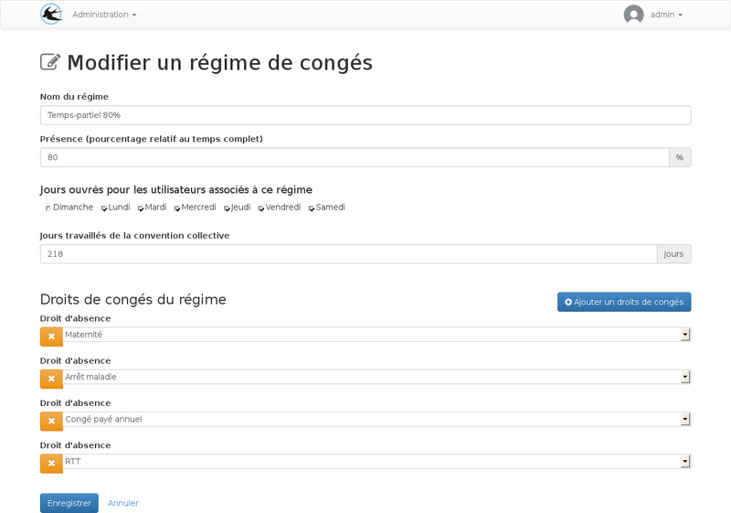

title: Régimes temps-partiels
layout: doc

---

## Généralités

Les régimes temps partiels peuvent utiliser les mêmes droits que les régimes de temps plein. Les
règles de calcul de la quantitée consommée prendrons en comptes un consomation suppérieure. Si on souhaite
que la durée total du droit de congés affiché pour les utilisateurs a temps partiel prenne déjà en compte
le temp partiel avec un nombre de jours inférieurs proportionel, il faudra pour cela créer des droits
différents, le chapitre suivant devra être ignoré dans ce cas et les régimes devrons contenir un
pourcentage de présence égal a 100%.

## Règles de calcul du temps consommé

Avec ces règles de calcul, on obtiendra une quantité consomé suppérieur au nombre de jours pris lors
d'une utilisation pour un régime temps partiel.

### Proportionellement au pourcentage de présence

La quantité consommée est obtenue avec la formule
durée consommée x (100 x (1/pourcentage de présence))

Paramètre du régime :

Indiquer un pourcentage de présence inférieur à 100%

Paramètres du droit :

Indiquer le type de consomation "proportionel au temps de présence"

Quelques examples :

* Pour un régime a 50% une absence de une journée va consommer 2 jours sur le solde.
* Pour un régime a 75% une absence de une journée va consommer 1,3 jours.

### Selon les Jours ouvrés

La consomation se fait uniquement sur des jours entiers, un jour entamée est un jour consommé, les
jours ouvrés non travaillé par le personnel a temps partiel sont comptabilisé comme consommé.

Paramètre du régime :

Cocher les jours ouvrés associés au régime

Paramètres du droit :

Indiquer le type de consomation "Consommer les jours ouvrés suivants"

Quelques examples :

Pour un régime non travaillé le vendredi

* Une absence le jeudi matin (durée 0,5 jour) va provoquer une consomation de 2 jours sur le solde de congés.
* Une absence le jeudi toute la journée (durée 1 jour) va provoquer une consomation de 2 jours sur le solde de congés.
* Une absence le mercredi matin (durée 0,5 jour) va provoquer une consomation de 1 jour sur le solde de congés.
* Une absence le mercredi toute la journée (durée 1 jour) va provoquer une consomation de 1 jour sur le solde de congés.

### Selon les jours travaillés

Ce type de calcul arrondi la cosommation du droit au jours entiers

Paramètre du régime :

Indiquer le nombre de jours travaillés annuels de la convention collective.

Paramètres du droit :

Indiquer le type de consomation "Consommer les jours travaillés suivants"

Quelques examples :

Pour un régime non travaillé le vendredi

* Une absence le jeudi matin (durée 0,5 jour) va provoquer une consomation de 1 jour sur le solde de congés.
* Une absence le jeudi toute la journée (durée 1 jour) va provoquer une consomation de 1 jour sur le solde de congés.
