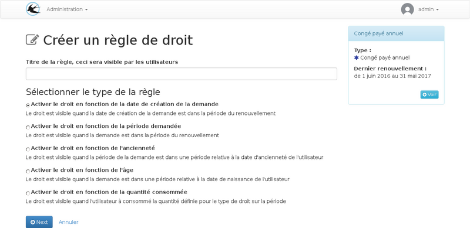

title: "Les règles des droits"
layout: doc
contentId: "doc-rights-rules"

---

A l'intention des administrateurs, ce document explique les règles qui peuvent être paramétrées sur les droit pour déterminer quand et comment les utilisateurs peuvent consommer le solde qui leur à été attribué.

<!-- more -->

## Généralités

Un droit est attribué à un utilisateur s'il est actif et associé au régime. Dans ce cas il apparaîtra sur la liste dans la page "Mes droits".
Un droit attribué permet la consultation du solde et des périodes de renouvellements.

Pour qu'un droit puisse être accessible à l'utilisateur lors d'une création de demande d'absence, il est nécessaire que le rôle "compte utilisateur absence" soit coché dans le champ "actif pour" du droit et que l'ensemble des règles définies sur le droit soient respectées.

Les règles tiennent compte à la fois des paramètres de l'utilisateur et des paramètres de la demande, elles sont utilisées par l'application une fois que la période d'absence demandée à été définit. Les règles servent à filtrer la liste des droits proposés lors de l'étape de répartition de la durée de l'absence sur les droits.

## les types de règles

### Date de la création de la demande

Cette règle permet de spécifier que la date de création de la demande doit être comprise dans la période du renouvellement. Des paramètres permettent de créer des périodes de tolérance avant ou après.

Il est recommandé d'utiliser ce type de règle en plus d'une règle en fonction de la période d'absence demandée car il ne permet pas de contrôler quand seront pris les congés.

Par exemple, si seul ce type de règle est mis en place, il est possible de poser une période d'absence plusieurs années à l'avance.

### Période d'absence demandée

Cette règle permet d'imposer que la période d'absence demandée soit comprise dans la période du renouvellement. Des paramètres permettent de créer des périodes de tolérance avant ou après.

Ce type de règle est le plus couramment utilisé.

### Ancienneté

Cette règle permet de rendre disponible un droit en fonction de l'ancienneté de l'utilisateur, C'est date de début de la période demandée qui sert de référence pour le calcul de la date d'ancienneté (l'ancienneté au premier jour de l'absence).

l'ancienneté est le nombre d'années entre la date de début d'ancienneté contenue dans les paramètres de l'utilisateur et la date de la demande. Si la date de début d'ancienneté n'est pas renseignée dans la fiche de l'utilisateur, cette règle ne sera jamais valide.

Ce type de règle permet de définir des intervalles pour l'ancienneté, ce qui permet de créer des paliers, par exemple :

* plus de 20 ans d'ancienneté : 1 jour supplémentaire de congés payés
* de 20 à 25 ans d'ancienneté : 2 jour supplémentaire de congés payés
* à partir de 25 ans d'ancienneté : 3 jour supplémentaire de congés payés

### Age

Cette règle permet de rendre disponible un droit en fonction de l'âge de l'utilisateur.

L'âge est calculé avec la date de naissance de l'utilisateur au premier jour de la période d'absence demandée.
