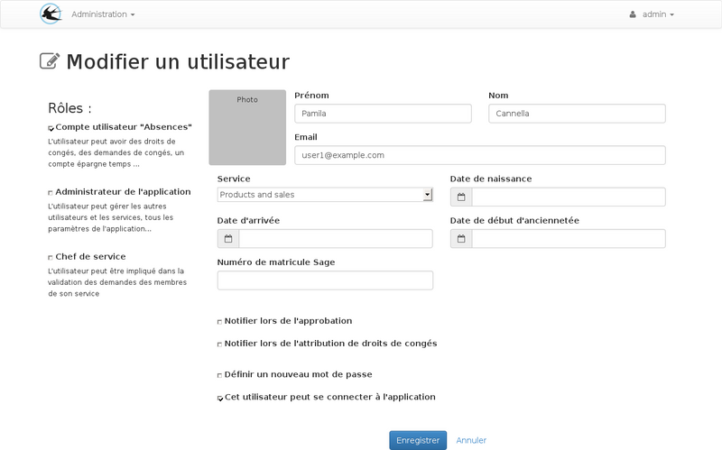
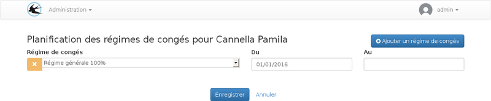
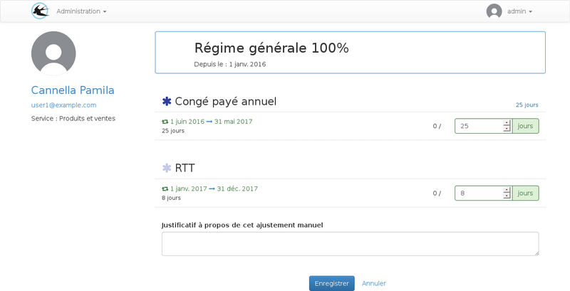
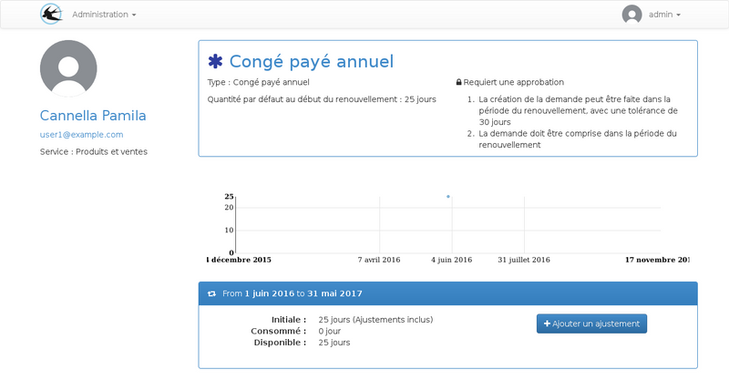
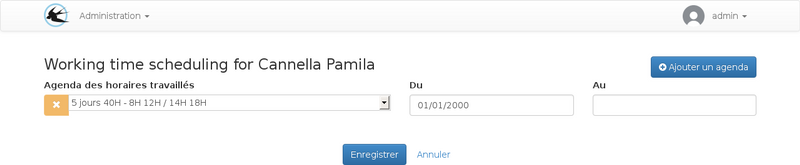
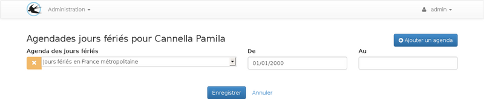

title: Planification des paramètres
layout: doc

---

Ce guide est destinés aux administrateurs pour planifier les attributions de droits.

## Arrivée dans l'enreprise

### La date d'arrivée

La date d'arrivée dans l'entreprise peut être enregistrée sur la fiche de l'utilisateur.

Cette date est utilisée pour :

* ignorer les renouvellements de droits de congés terminés avant l'arrivée de l'utilisateur.
* Ingorer les ajustement de la quantité enregistrés avant la date d'arrivée.

Par example, pour les contrats à durée déterminée, il est possible d'utiliser un droit
de congés payés avec un incrémentation mensuelle de la quantité automatique le premier
jour du mois. Dans ce cas les ajustements mensuels des mois qui précède la date d'arrivée
serons ignorés.

Ce paramètre fait varier la quantité initiale du droit de manière distincite pour chaque
utilisateur.

La date d'arrivée est modifiable sur le formulaire de l'utilisateur :

### Paramétrage de la date de début du régime

Depuis la fiche de visualisation, on peut accéder à la planification des régimes.

Lors de 'arrivée de l'utilisateur, il conviens de créer une ligne contenant son régime
et uniquement la date de début pour la période déattribution.

Les droits du régime serons disponibles à partir cette date.

La date de fin ne sera utile que s'il est souhaitable de définir à l'avance une date
ou les droits du régime ne doivent plus être disponible. Cela peut éviter d'avoir
a venir désactiver l'utilisateur à une date précise.

### Modification de la quantité

Pour les droits crédités par mois ou par jours de travail, la quantité initiale doit être modifiée pour prendre en compte les jours travaillés sur le premier renouvellement.

Pour les droits crédités par période de renouvellement, la quantité initiale paramétrée sur le droit sera attribuée donc il n'est pas nécessaire des faire des modification.

Depuis la fiche de l'utilisateur, cliquez sur le régime pour modifier les quantités :

L'enregistrement de se formulaire va créer des ajustements sur les droits concernés.

Les ajustements peuvent être visualisé ou ajoutés de manière individuelle sur la fiche
du droit pour l'utilisateur, cet écran est accessible depuis la fiche de visualisation, dans le tableau "Droits d'absences" :

## Changement de régime

En cas de changement de régime, une date de fin devra être définie sur la plage de date du premier régime, et une nouvelle plage de date devra être ajoutée pour le nouveau régime.

La date de fin de la nouvelle plage de date n'est pas obligatoire.

Lorsque plusieurs régimes sont associés à l'utilisateur, l'écran de modification
des quantités sur les renouvellements peut être utilisé pour définir les quantités
sur les régimes qui ne sont pas encore en cours de validité. Des flèches sont disponibles à coté du nom du régime pour naviger vers les régimes suivants ou précédents.

## Changement de rythme de travail

L'écran de planification du rythme de travail est accessible depuis la fiche de visualisation de l'utilisateur :

## Choix de l'agenda des jours fériés

L'écran de planification des jours fériés est accessible depuis la fiche de visualisation de l'utilisateur :

Cet écran peut être utilisé dans le cas d'un changement de législation, dans ce
cas il faudra modifier la planification pour tous les utilisateurs pour basculer vers le nouvel agenda des jours fériés.

Dans le cas ou l'utilisateur va travailler dans un autre pays avec des jours différents seul sa fiche sera à modifier.
