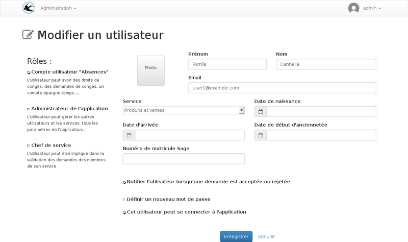

title: Planification des paramètres
layout: doc

---

## Arrivée dans l'enreprise

### La date d'arrivée

La date d'arrivée dans l'entreprise peut être enregistrée sur la fiche de l'utilisateur.

Cette date est utilisée pour :

* ignorer les renouvellements de droits de congés terminés avant l'arrivée de l'utilisateur.
* Ingorer les ajustement de la quantité enregistrés avant la date d'arrivée.

Par example, pour les contrats à durée déterminée, il est possible d'utiliser un droit
de congés payés avec un incrémentation mensuelle de la quantité automatique le premier
jour du mois. Dans ce cas les ajustements mensuels des mois qui précède la date d'arrivée
serons ignorés.

Ce paramètre fait varier la quantité initiale du droit de manière distincite pour chaque
utilisateur.

La date d'arrivée est modifiable sur le formulaire de l'utilisateur :

### Paramétrage de la date de début du régime

### Modification de la quantité

Pour les droits crédités par mois ou par jours de travail, la quantité initiale doit être modifiée pour prendre en compte les jours travaillés sur le premier renouvellement.

Pour les droits crédités par période de renouvellement, la quantité initiale paramétrée sur le droit sera attribuée donc il n'est pas nécessaire des faire des modification.

## Changement de régime

En cas de changement de régime, une date de fin devra être définie sur la plage de date du premier régime, et une nouvelle plage de date devra être ajoutée pour le nouveau régime.

La date de fin de la nouvelle plage de date n'est pas obligatoire.

## Changement de rythme de travail

## Choix de l'agenda des jours fériés
